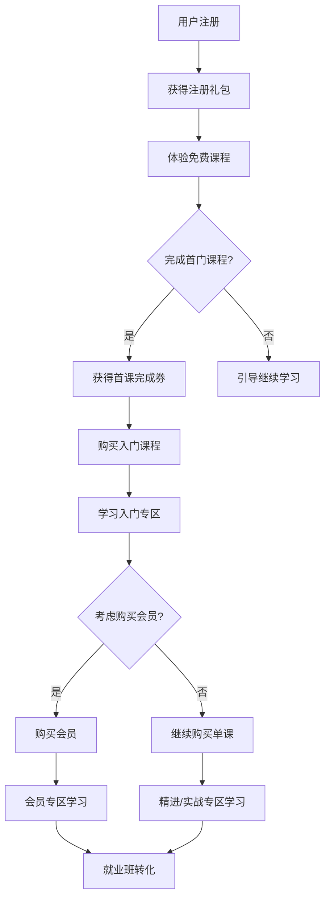
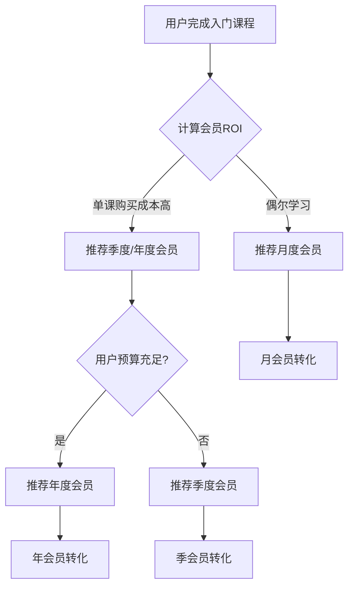

# UAI AI+Logo设计教育平台产品需求文档

## 文档信息

| 文档版本 | 创建时间 | 最后更新 | 作者 | 状态 |
|---------|---------|----------|------|------|
| v2.2 | 2025-01-29 | 2025-01-29 | John (产品经理) | 已完善 |

---

## 1. 产品概述

### 1.1 产品定位
UAI教育平台是一个专注于AI辅助Logo设计教育的在线学习平台，为成人转型平面设计学员提供从零基础到就业的完整学习路径。

### 1.2 核心价值主张
- **AI赋能设计教育**：结合人工智能工具降低Logo设计学习门槛
- **递进式学习体系**：从体验到就业的7层课程架构
- **会员权益激励**：通过会员体系和优惠券策略促进持续学习
- **实战项目导向**：以商业项目为导向的实用技能培养

### 1.3 目标用户
- **主要用户**：25-40岁成人学员，希望转型或提升平面设计技能
- **次要用户**：在校学生、设计爱好者、小微企业主
- **地域定位**：中国大陆用户（简体中文）

---

## 2. 市场分析与商业模式

### 2.1 商业模式
- **课程销售**：单课程付费购买
- **会员订阅**：月费/季费/年费会员体系
- **就业班**：高价值综合实战课程
- **增值服务**：设计工具、素材资源、作品点评

### 2.2 收入结构预期
- **会员收入占比**：40-50%（稳定现金流）
- **课程销售占比**：30-35%（核心收入）
- **就业班收入占比**：15-20%（高价值转化）
- **增值服务占比**：5-10%（未来拓展）

---

## 3. 核心功能架构

### 3.1 课程体系架构

#### 3.1.1 七层递进式学习路径

```
体验专区 (免费) 
    ↓
入门专区 (付费)
    ↓  
精进专区 (付费)
    ↓
实战专区 (付费)
    ↓
项目落地专区 (付费)
    ↓
会员专区 (会员专享)
    ↓
就业大型班 (高价课程)
```

#### 3.1.2 各专区详细定义

**🎯 体验专区（免费引流）**
- **目标**：快速掌握基本软件操作，降低学习门槛
- **核心课程**：
  - Illustrator快速制作Logo（2小时体验）
  - Adobe Firefly AI智能辅助设计体验
  - PS基础入门
  - Illustrator基础入门  
  - Figma基础操作
- **商业目的**：用户获得成就感，产生购买后续课程的意愿

**📚 入门专区（第一付费转化）**
- **目标**：建立Logo设计基础技能和AI工具认知
- **核心课程**：
  - Illustrator制作Logo的常用命令技巧
  - AI人工智能在Logo中的应用
- **价格策略**：相对较低，配合新用户7折券促进转化

**🎨 精进专区（技能深化）**
- **目标**：提升设计品质和创意水平
- **核心课程**：
  - 字体设计在Logo中的应用
  - 不同风格的Logo设计体验
- **学习前置**：完成入门专区课程

**⚒️ 实战专区（技能应用）**
- **目标**：掌握高级技巧和商业应用流程
- **核心课程**：
  - Illustrator里Logo制作高级技巧
  - AI人工智能Logo设计商业流程
- **特点**：更注重实际操作和商业应用

**🏢 项目落地专区（商业化准备）**
- **目标**：完整的商业项目制作流程
- **核心课程**：
  - Logo商业制作流程
  - Logo设计与灵感触发
- **特点**：以真实项目为案例，培养商业思维

**💎 会员专区（会员专享价值）**
- **目标**：高价值中型项目实战
- **核心课程**：
  - AI智能Logo速成营
  - AI品牌标识工作坊  
  - AI创意Logo实验室
  - 一小时做出你的AI品牌标志
  - AI+设计思维：从灵感到Logo成品
  - Logo新纪元：AI驱动的品牌设计
  - AI智能商标设计与IP打造
  - 零基础用AI做企业Logo与VI
  - AI+Logo商业实战班
  - AI Logo提示词全攻略
- **权限控制**：仅会员可观看，或非会员高价单独购买

**🎓 就业大型班（终极转化目标）**
- **目标**：培养职业Logo设计师
- **核心课程**：成为职业Logo设计师（大型综合课程）
- **特点**：高价值、长周期、就业导向

### 3.2 会员体系设计

#### 3.2.1 会员级别与定价

| 会员类型 | 价格 | 课程权益 | 优惠券权益 | 就业班权益 |
|---------|------|----------|------------|------------|
| **月会员** | ¥129 | 会员专区访问权限 | 1张普通课7折券(1个月有效) | 9折券(学完普通课后获得) |
| **季会员** | ¥229 | 会员专区访问权限 | 2张普通课7折券(3个月有效) | 9折券(立即获得) |
| **年会员** | ¥799 | 会员专区访问权限 | 6张普通课7折券(1年有效) | 8折券(立即获得) |
| **长期会员** | ¥1999 | 会员专区永久访问 | 12张普通课7折券(每年刷新) | 7折券(立即获得) |

#### 3.2.2 会员权益详细说明

**🎯 核心权益**
- **会员专区无限观看**：价值超过单独购买成本
- **普通课程7折特权**：适用体验/入门/精进/实战/项目落地课程
- **就业班专属折扣**：根据会员等级享受不同折扣
- **优先客服支持**：会员专属客服通道

**📈 权益升级策略**
- 老会员锁定购买时权益，价格上调不影响已购用户
- 会员价格随课程数量和服务价值增加而调整
- 长期会员享有最高性价比和稳定权益

### 3.3 营销转化体系

#### 3.3.1 新用户转化漏斗

```
用户注册 → 注册礼包 → 体验免费课 → 首课完成激励 → 购买普通课 → 升级会员 → 就业班转化
```

#### 3.3.2 关键转化节点

**🎁 注册礼包（降低首次购买门槛）**
- **触发条件**：新用户完成手机验证码注册
- **礼包内容**：
  - 1张普通课7折券（7天有效期）
  - AI设计模板包/Mockup资源包
- **商业目的**：快速促进首次付费转化

**🏆 首课完成激励（建立学习习惯）**
- **触发条件**：非会员用户完成首门课程（观看≥90%且完成作业/测验）
- **激励内容**：1张普通课7折券（3天有效期）
- **设计逻辑**：短期有效促进连续学习，建立学习习惯

**📅 积分签到系统（日活留存）**
- **基础积分**：每日签到10分（不要求连续）
- **学习积分**：观看课程+2分，每日上限20分
- **积分清零**：年底清零，促进年内消费
- **兑换体系**：
  - 100分 → 满100减10元券
  - 200分 → 满200减20元券  
  - 300分 → 满300减50元券
- **防套利**：新用户首月最多兑换1张券

#### 3.3.3 优惠券使用规则

**📋 通用规则**
- 每笔订单限用1张券
- 7折券和积分券二选一，不可叠加
- 券逾期自动失效，不可转赠
- 不适用于会员课程或就业班课程（有专门的就业班折扣券）

**⏰ 有效期策略**
- 注册礼包券：7天（促进快速转化）
- 首课完成券：3天（促进连续学习）
- 会员权益券：与会员周期同步
- 积分兑换券：兑换后30天有效

---

## 4. 用户认证与个人中心

### 4.1 注册登录系统

#### 4.1.1 注册方式
- **主要方式**：手机+验证码（支持大陆、港澳台号码）
- **短信服务**：阿里云国际/港澳台短信业务
- **扩展认证**：注册后可在个人中心添加密码、邮箱、微信绑定

#### 4.1.2 登录方式
- 手机+验证码
- 手机+密码  
- 微信登录（绑定后）

#### 4.1.3 个人信息管理
- 昵称设置
- 头像上传
- 联系方式管理
- 密码修改
- 第三方账号绑定/解绑

### 4.2 个人中心功能模块

#### 4.2.1 学习数据面板
- **我的报名**：已购买课程列表和学习进度
- **我的完成**：已完成课程数量和证书
- **CG作品集**：学习作品展示和管理

#### 4.2.2 会员中心
- **会员状态**：当前会员级别和到期时间
- **会员权益**：可用优惠券和权益说明
- **续费升级**：会员续费和升级入口
- **会员历史**：历史会员购买记录

#### 4.2.3 订单管理
- **来访记录**：浏览历史和收藏课程
- **学习统计**：学习时长和完成率统计
- **订单中心**：购买记录和发票管理
- **申请开课**：课程咨询和定制需求

#### 4.2.4 营销互动
- **推广有礼**：邀请好友和奖励机制
- **积分中心**：签到记录、积分余额、兑换历史

---

## 5. 电商交易系统

### 5.1 购物车系统

#### 5.1.1 购物车功能
- **商品添加**：课程加入购物车
- **数量管理**：单课程不支持数量增减（数字商品特性）
- **商品展示**：课程封面、标题、价格、评分
- **优惠计算**：实时显示优惠券折扣效果
- **批量操作**：全选、批量删除
- **收藏移动**：移入我的收藏列表

#### 5.1.2 价格计算逻辑
```
最终价格 = 原价 - 优惠券折扣
优惠金额 = max(优惠券折扣, 积分券满减)
```

### 5.2 订单支付流程

#### 5.2.1 订单确认页面
- **商品信息确认**：课程详情和价格
- **优惠券选择**：可用优惠券列表和应用
- **支付方式选择**：支付宝、微信支付
- **订单总额显示**：原价、优惠、实付金额
- **支付倒计时**：14:50分钟支付时限

#### 5.2.2 支付集成
- **支付宝**：主推支付方式，用户习惯良好
- **微信支付**：备选支付方式
- **安全保障**：7×24小时客服、数据加密
- **支付状态**：实时支付状态更新和结果反馈

### 5.3 订单管理系统

#### 5.3.1 订单状态流程
```
待支付 → 支付成功 → 课程开通 → 学习中 → 已完成
```

#### 5.3.2 退费政策
- **MVP阶段**：购买即视为使用，不适用7日无理由退费
- **平台停办**：按5年折旧退费公式计算
- **未来优化**：根据法务要求调整7天退费细则

---

## 6. 技术架构需求

### 6.1 前端技术栈

#### 6.1.1 核心技术
- **框架**：Vue 3 + TypeScript + Vite
- **UI库**：Bootstrap 5.3.6（已实现）
- **状态管理**：Pinia
- **路由**：Vue Router
- **HTTP客户端**：Axios

#### 6.1.2 关键实现要求
- **响应式设计**：支持移动端、平板、桌面端
- **性能优化**：代码分割、懒加载、图片优化
- **SEO优化**：动态meta标签、结构化数据
- **用户体验**：流畅的页面切换、友好的错误处理

### 6.2 后端技术栈

#### 6.2.1 核心技术
- **框架**：Django 5.2 + Django REST Framework
- **数据库**：MySQL 8.4+（生产）/ SQLite（开发）
- **认证**：JWT（SimpleJWT）
- **缓存**：Redis（可选）

#### 6.2.2 API设计规范
```json
{
  "status": 200,
  "data": {},
  "msg": "Success"
}
```

### 6.3 第三方服务集成

#### 6.3.1 支付服务
- **支付宝**：主要支付渠道
- **微信支付**：备用支付渠道
- **支付安全**：订单加密、支付状态同步

#### 6.3.2 通信服务
- **短信服务**：阿里云国际短信（支持大陆、港澳台）
- **邮件服务**：系统通知和营销邮件
- **客服系统**：在线客服和工单系统

#### 6.3.3 数据分析
- **百度统计**：用户行为分析和转化跟踪
- **自定义事件**：关键业务指标追踪
- **数据安全**：仅基于用户ID跟踪，无敏感个人信息

---

## 7. 关键业务流程

### 7.1 用户学习路径流程



### 7.2 会员转化决策树



### 7.3 营销自动化流程

#### 7.3.1 新用户激活序列
- **Day 0**：注册欢迎邮件 + 7折券提醒
- **Day 3**：未购买用户券到期提醒
- **Day 7**：体验课程推荐和学习指导
- **Day 14**：学习进度关怀和答疑邀请
- **Day 30**：长期学习价值和会员推荐

#### 7.3.2 会员留存策略
- **续费前30天**：会员价值回顾和续费优惠
- **续费前7天**：紧急续费提醒
- **到期当天**：最后机会续费
- **到期后3天**：重新激活特价

---

## 8. 成功指标与数据追踪

### 8.1 核心KPI指标

#### 8.1.1 用户增长指标
- **新用户注册数**：目标月增长20%
- **用户活跃率**：DAU/MAU > 15%
- **用户留存率**：7日留存 > 40%，30日留存 > 20%

#### 8.1.2 转化漏斗指标
- **注册到首购转化率**：目标 > 25%
- **免费到付费转化率**：目标 > 30%
- **单课到会员转化率**：目标 > 15%
- **会员到就业班转化率**：目标 > 10%

#### 8.1.3 商业化指标
- **ARPU（人均收入）**：目标 > ¥200
- **LTV（用户生命周期价值）**：目标 > ¥800
- **CAC（用户获取成本）**：控制在LTV的1/4以内
- **会员续费率**：目标 > 60%

### 8.2 事件追踪设计

#### 8.2.1 关键业务事件
```javascript
// 用户行为事件
user.register        // 用户注册
user.login           // 用户登录
user.profile.complete // 完善个人资料

// 学习行为事件  
course.view          // 课程页面访问
course.play.start    // 开始观看课程
course.play.complete // 完成课程学习
course.homework.submit // 提交作业

// 商业化事件
cart.add            // 添加到购物车
order.create        // 创建订单
payment.success     // 支付成功
membership.purchase // 购买会员
coupon.use          // 使用优惠券

// 营销事件
signup.gift.claim   // 领取注册礼包
first.course.reward // 首课完成奖励
daily.checkin       // 每日签到
points.redeem       // 积分兑换
```

### 8.3 数据分析框架

#### 8.3.1 实时监控面板
- **当日新用户注册数**
- **实时在线学习人数**  
- **今日订单量和GMV**
- **关键转化漏斗实时数据**

#### 8.3.2 周期性分析报告
- **周报**：用户增长、活跃度、收入概况
- **月报**：详细的用户行为分析和商业化表现
- **季报**：产品迭代效果和市场趋势分析

---

## 9. 前端技术实现架构补充

### 9.1 项目技术架构现状分析

#### 9.1.1 现有架构评估
基于对Frontend目录的深入分析，当前技术架构状况：

**✅ 已完成的架构基础**：
- Vue 3 + TypeScript + Vite核心框架搭建完成
- Bootstrap 5.3.6 UI框架集成
- 基础组件库（购物车、订单、个人中心）已建立
- Pinia状态管理基础架构就绪
- 路由系统和页面结构清晰

**⚠️ 需要完善的关键模块**：
- API集成层不完整（缺少src/api/目录核心模块）
- SEO组件系统缺失（影响搜索引擎优化效果）
- Analytics追踪系统未实现（无法监控PRD中定义的关键指标）
- 图片资源管理混乱（public/和src/assets/重复，缺乏规范）
- 状态管理不完整（缺少关键业务模块的Store）

#### 9.1.2 架构完善优先级
基于PRD业务需求和现有代码状态，技术实现优先级：

**P0 - 立即实现（影响核心功能）**：
- API服务层完整实现
- 核心业务状态管理补全

**P1 - 短期实现（影响用户体验）**：
- SEO组件系统建立
- 图片资源规范化管理

**P2 - 中期实现（影响业务监控）**：
- Analytics集成和事件追踪
- 性能优化和错误处理完善

### 9.2 前端架构实现需求详细定义

#### 9.2.1 功能实现需求（FR）

**FR1**: Frontend必须实现完整的API集成层，包括src/api/目录下的所有服务模块，确保与Django后端的无缝对接
- **具体要求**：auth.ts, courses.ts, cart.ts, orders.ts, membership.ts, analytics.ts
- **响应格式**：严格遵循PRD定义的`{status, data, msg}`结构
- **认证集成**：自动JWT token附加和刷新机制

**FR2**: 状态管理系统需要完整实现所有业务模块的Pinia stores，确保数据流的完整性和一致性
- **新增Store**：cartStore.ts, membershipStore.ts, analyticsStore.ts, seoStore.ts  
- **架构规范**：使用Composition API风格的defineStore()
- **数据持久化**：localStorage用于用户信息，sessionStorage用于临时状态

**FR3**: 必须实现SEO组件系统，支持动态meta标签、结构化数据和搜索引擎优化
- **核心组件**：SEOHead.vue, FAQSection.vue, BreadcrumbSEO.vue, SchemaData.vue
- **动态优化**：每个页面自定义SEO信息，支持Vue Router集成
- **结构化数据**：符合Google和百度的Schema.org规范

**FR4**: Analytics集成必须实现百度统计和自定义事件追踪，支持PRD中定义的所有关键业务指标监控
- **事件追踪**：用户旅程、学习行为、商业化转化、营销活动
- **数据策略**：前端缓存+批量发送，确保数据完整性
- **隐私合规**：仅基于用户ID追踪，无敏感个人信息

#### 9.2.2 非功能性需求（NFR）

**NFR1**: 页面首屏加载时间不超过2秒，通过代码分割和懒加载实现
- **实现策略**：Vue Router懒加载，图片懒加载，关键资源预加载
- **监控指标**：Core Web Vitals (LCP < 2s, FID < 100ms, CLS < 0.1)

**NFR2**: 图片资源必须实现统一的import管理策略，避免当前public/和src/assets/的混乱状态
- **规范要求**：所有图片使用import导入，禁止字符串路径引用
- **性能优化**：WebP格式优先，PNG作为fallback，实现响应式图片

**NFR3**: 组件库必须严格遵循Bootstrap 5.3.6，确保UI一致性和响应式设计
- **开发规范**：优先使用Bootstrap utility classes，最小化自定义CSS
- **响应式要求**：所有组件在mobile/tablet/desktop都有良好体验

**NFR4**: 必须实现完整的错误处理和用户反馈机制，提升用户体验质量
- **Toast组件**：成功/错误/警告/信息四种类型的统一反馈
- **错误边界**：组件级错误捕获，防止应用崩溃
- **API错误处理**：网络错误重试，用户友好的错误提示

#### 9.2.3 兼容性和集成需求（CR）

**CR1**: API集成必须与现有Django后端完全兼容，遵循既定的接口规范和数据格式

**CR2**: 新增功能必须保持与现有组件架构的向后兼容，不能破坏已有的购物车、订单、个人中心功能

**CR3**: 必须与现有的Vue 3 Composition API + TypeScript架构保持一致，禁止混用Options API

**CR4**: 路由和状态管理必须支持PRD中定义的完整用户流程，从注册到购买到学习的全链路体验

### 9.3 关键模块详细实现策略

#### 9.3.1 API集成层实现方案

```typescript
// src/api/ 目录完整架构
api/
├── index.ts          // Axios统一配置和拦截器
├── auth.ts           // 用户认证（登录/注册/JWT管理）
├── courses.ts        // 课程管理（列表/详情/搜索）  
├── cart.ts           // 购物车（添加/移除/结算）
├── orders.ts         // 订单处理（创建/支付/查询）
├── membership.ts     // 会员系统（权益/续费/升级）
├── analytics.ts      // 数据追踪（事件上报/用户行为）
└── upload.ts         // 文件上传（头像/作业/资料）
```

**核心实现要求**：
- 统一错误处理和重试机制
- JWT token自动附加和刷新
- TypeScript类型定义完整
- 请求/响应拦截器实现监控和日志

#### 9.3.2 SEO组件系统架构

```vue
<!-- src/components/seo/ 组件架构 -->
seo/
├── SEOHead.vue       // 动态meta标签管理
├── FAQSection.vue    // 结构化FAQ组件  
├── BreadcrumbSEO.vue // SEO友好面包屑导航
└── SchemaData.vue    // JSON-LD结构化数据
```

**实现重点**：
- 动态meta标签与Vue Router集成
- 结构化数据符合Schema.org规范
- FAQ组件支持展开/收起交互
- 面包屑导航提供完整页面层级

#### 9.3.3 状态管理架构完善

```typescript
// src/store/ 新增Store模块
store/
├── index.ts          // 现有：Store配置和导出
├── authStore.ts      // 现有：用户认证状态
├── courseStore.ts    // 现有：课程数据状态
├── uiStore.ts        // 现有：UI/UX状态
├── cartStore.ts      // 新增：购物车状态管理
├── membershipStore.ts // 新增：会员状态和权益
├── analyticsStore.ts // 新增：用户行为数据缓存
└── seoStore.ts       // 新增：SEO相关状态
```

**架构原则**：
- 单一职责：每个Store管理一个业务域
- 类型安全：完整的TypeScript接口定义
- 数据持久化：关键状态的本地存储策略
- 响应式设计：与Vue组件的自动响应式绑定

#### 9.3.4 Analytics事件追踪实现

```typescript
// src/composables/useAnalytics.ts 实现策略
export const useAnalytics = () => {
  // 百度统计集成
  const trackPageView = (pagePath: string) => void
  const trackEvent = (eventName: string, eventData?: Record<string, any>) => void
  const trackConversion = (conversionType: string, value?: number) => void
  
  // PRD定义的核心业务事件
  const trackUserJourney = (stage: 'register' | 'first-course' | 'purchase' | 'member') => void
  const trackPurchaseFunnel = (step: string, courseId?: string, amount?: number) => void
  const trackLearningBehavior = (action: string, courseId: string, progress?: number) => void
  
  return { 
    trackPageView, trackEvent, trackConversion, 
    trackUserJourney, trackPurchaseFunnel, trackLearningBehavior 
  }
}
```

### 9.4 开发流程和质量保证机制

#### 9.4.1 TypeScript严格模式配置

```json
// tsconfig.json 生产级配置要求
{
  "compilerOptions": {
    "strict": true,
    "noImplicitAny": true,
    "noImplicitReturns": true,
    "noUnusedLocals": true,
    "noUnusedParameters": true
  }
}
```

#### 9.4.2 组件开发标准规范

- **命名规范**: PascalCase组件名 (UserProfile.vue)，camelCase API服务 (userService.ts)
- **Props定义**: 必须使用TypeScript接口，支持默认值和验证
- **事件声明**: 所有组件emits必须明确声明类型
- **样式规范**: 优先Bootstrap utility classes，自定义样式使用scoped

#### 9.4.3 测试和质量门控

**单元测试覆盖**：
- API服务层 (src/api/*.ts) - 100%覆盖率要求
- Pinia stores (src/store/*.ts) - 核心业务逻辑测试
- 关键组件 (CourseCard, Cart, Order) - 用户交互测试
- 工具函数 (src/utils/*.ts) - 边界条件测试

**性能监控指标**：
- Bundle大小控制 (<1MB gzipped)
- 首屏加载时间 (<2s)
- JavaScript执行时间 (<50ms)
- 内存使用监控 (<100MB)

### 9.5 Epic和Story实施结构

#### 9.5.1 Epic结构决策

**Epic方案**: 单一综合Epic - "Frontend技术架构完善与关键模块集成"

**决策理由**：
- 现有项目的技术架构完善任务，各模块紧密相关
- API集成、SEO组件、Analytics等相互依赖，需要协调实施  
- 保证技术架构的一致性和完整性
- 通过分阶段Story实现，最小化对现有功能的风险

#### 9.5.2 详细Story实施计划

**Story 1.1: 建立完整的API集成层**
- **优先级**: P0 - 立即实施
- **工期估算**: 3-5个开发日
- **关键交付**: src/api/目录下6个核心服务模块
- **集成验证**: 与现有authStore兼容，不影响现有组件数据展示

**Story 1.2: 实现SEO组件系统**  
- **优先级**: P1 - 短期实施
- **工期估算**: 2-3个开发日
- **关键交付**: 4个SEO核心组件，支持动态meta标签
- **集成验证**: 不影响页面性能，搜索引擎验证工具通过

**Story 1.3: 完善状态管理系统**
- **优先级**: P0 - 立即实施  
- **工期估算**: 2-3个开发日
- **关键交付**: 4个新增Store模块，状态持久化策略
- **集成验证**: 与现有Store无冲突，组件响应式更新正常

**Story 1.4: 集成Analytics追踪系统**
- **优先级**: P2 - 中期实施
- **工期估算**: 3-4个开发日  
- **关键交付**: useAnalytics composable，事件追踪完整覆盖
- **集成验证**: 不影响性能，数据正确发送到百度统计

**Story 1.5: 优化图片资源管理和性能**
- **优先级**: P1 - 短期实施
- **工期估算**: 1-2个开发日
- **关键交付**: 资源规范化，性能优化实施
- **集成验证**: 不破坏现有显示效果，加载性能提升

---

## 10. 产品迭代路线图

### 10.1 MVP阶段（当前-未来2个月）

#### 10.1.1 优先级P0功能（必须完成）
- ✅ **基础页面框架**：首页、课程详情、购物车、订单、用户中心
- 🔄 **会员体系完善**：会员权益展示、会员专区权限控制
- 🔄 **优惠券系统**：券的发放、使用、限制逻辑
- 🔄 **积分签到系统**：签到功能、积分兑换、防套利机制

#### 10.1.2 优先级P1功能（重要）
- **AI工具集成**：基础的AI Logo生成工具
- **作业提交系统**：学员作品上传和教师点评
- **学习进度追踪**：课程完成度和学习时长统计
- **客服系统**：在线客服和问题反馈

### 10.2 成长阶段（2-6个月）

#### 10.2.1 功能增强
- **高级AI工具**：更多AI设计工具集成和定制化
- **社区功能**：学员作品展示、互评、设计比赛
- **直播教学**：实时互动课程和答疑
- **移动APP**：iOS和Android原生应用

#### 10.2.2 运营优化
- **个性化推荐**：基于学习行为的课程推荐
- **营销自动化**：邮件营销和用户生命周期管理
- **数据分析平台**：用户行为深度分析和商业智能

### 10.3 扩展阶段（6个月以上）

#### 10.3.1 业务拓展
- **多品类课程**：扩展到UI设计、品牌设计等领域
- **企业培训**：面向企业的定制化培训服务
- **设计工具SaaS**：独立的AI设计工具产品
- **设计师接单平台**：连接设计师和客户的服务平台

#### 10.3.2 技术升级
- **微服务架构**：支持更大规模的用户和业务
- **AI能力提升**：自研AI算法和设计生成能力
- **国际化支持**：海外市场扩展和多语言支持

---

## 11. 风险评估与应对策略

### 11.1 商业风险

#### 11.1.1 市场竞争风险
- **风险描述**：在线设计教育竞争激烈
- **应对策略**：
  - 专注AI+Logo设计细分领域，建立差异化优势
  - 持续产品创新和用户体验优化
  - 建立强大的师资团队和课程内容护城河

#### 11.1.2 用户获取成本风险  
- **风险描述**：获客成本可能持续上升
- **应对策略**：
  - 建立完善的用户推荐和分享机制
  - 提升产品口碑和自然增长能力
  - 优化转化漏斗，提升单用户价值

### 11.2 技术风险

#### 11.2.1 系统稳定性风险
- **风险描述**：用户增长导致系统压力
- **应对策略**：
  - 提前进行性能优化和压力测试
  - 建立完善的监控和告警机制
  - 制定紧急扩容和故障恢复预案

#### 11.2.2 数据安全风险
- **风险描述**：用户数据泄露或支付安全问题
- **应对策略**：
  - 严格遵循数据安全和隐私保护法规
  - 使用成熟的支付服务商降低支付风险
  - 建立完善的数据备份和恢复机制

### 11.3 运营风险

#### 11.3.1 内容质量风险
- **风险描述**：课程质量不达标影响用户满意度
- **应对策略**：
  - 建立严格的课程内容审核和质量标准
  - 收集用户反馈并持续改进课程内容
  - 建立优秀讲师激励和培养机制

#### 11.3.2 用户留存风险
- **风险描述**：用户学习完成率低，续费率下降
- **应对策略**：
  - 优化课程设计，提升学习体验和完成率
  - 建立学习激励机制和社区氛围
  - 持续跟进用户学习进度和及时干预

---

## 12. 附录

### 12.1 术语表

| 术语 | 定义 |
|------|------|
| **转化漏斗** | 从注册到付费的各个关键节点转化率 |
| **LTV** | Life Time Value，用户生命周期价值 |
| **CAC** | Customer Acquisition Cost，用户获取成本 |
| **ARPU** | Average Revenue Per User，用户平均收入 |
| **GMV** | Gross Merchandise Volume，交易总额 |
| **DAU/MAU** | Daily/Monthly Active Users，日/月活跃用户 |

### 12.2 参考文档
- uaiPrePrd/PRD_Membership_Module.md - 会员模块设计详细说明
- uaiPrePrd/Marketing_Rules.md - 营销规则和优惠券策略
- uaiPrePrd/UaiPrd文档补充说明.md - 课程体系和注册登录规则
- frontend/CLAUDE.md - 前端技术架构和开发规范
- 根目录/CLAUDE.md - 整体项目技术架构
- **docs/FRONTEND_IMPLEMENTATION_GUIDE.md** - 前端架构实现指南（已整合至本PRD第9章）
- **docs/API_SPECIFICATION.md** - API接口规范文档（建议交给架构师处理）

### 12.3 更新日志
- **v1.0** (2025-01-27): 初始SEO优化PRD版本
- **v2.0** (2025-01-29): 基于实际业务需求完全重构，聚焦AI+Logo设计教育平台核心功能
- **v2.1** (2025-01-29): 新增"前端技术实现架构补充"章节，为前端开发提供详细的技术实现指导和Epic/Story规划
- **v2.2** (2025-01-29): 完善前端技术架构实现细节，整合FRONTEND_IMPLEMENTATION_GUIDE.md内容，提供完整的技术实施方案

---

*本PRD由John（产品经理）基于uaiPrePrd详细需求文档和前端界面分析创建，反映UAI AI+Logo设计教育平台的实际业务需求和功能架构。*