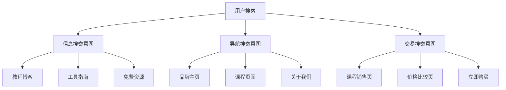

# UAI全球化AI+Logo设计教育平台综合产品需求文档

## 文档信息

| 文档版本 | 创建时间 | 最后更新 | 作者 | 状态 |
|---------|---------|----------|------|------|
| v3.0 | 2025-01-30 | 2025-01-30 | John (产品经理) | 整合完成 |

---

## 🌍 执行摘要

UAI教育平台将从单一大陆市场扩展为全球化双站架构，通过**大陆站+海外站**的差异化策略，实现**SEO+AEO双引擎优化**，构建AI辅助Logo设计教育的全球生态系统。

**核心战略升级**：
- **双域名策略**：uaiedu.com（大陆简体中文）+ uaiedu.org（海外双语）
- **SEO+AEO融合**：传统搜索优化 + 问答引擎优化
- **差异化定位**：大陆专注本土转化 + 海外注重权威建设
- **技术架构分离**：独立部署、内容同步、用户数据隔离

---

## 1. 产品概述与全球化定位

### 1.1 产品重新定位

**大陆版（uaiedu.com）**：
- **定位**：AI辅助Logo设计教育专业平台
- **用户群体**：25-40岁成人转型学员（中国大陆）
- **语言策略**：简体中文单一语言，移除繁简转换复杂度
- **商业模式**：快速转化导向，实用技能培养

**海外版（uaiedu.org）**：
- **定位**：专业AI设计教育国际权威平台
- **用户群体**：海外华人学员 + 国际设计学习者
- **语言策略**：英文+简体中文双语支持
- **商业模式**：权威建设导向，深度专业培养

### 1.2 核心价值主张升级

**技术创新价值**：
- AI赋能设计教育：Firefly、Midjourney等AI工具深度整合
- 智能化学习路径：基于用户画像的个性化推荐
- 实时作品评价：AI辅助的设计质量评估系统

**教育价值增强**：
- 7层递进式学习体系（体验→入门→精进→实战→项目落地→会员→就业）
- 就业导向培养：与行业合作的实战项目
- 国际化视野：跨文化设计美学培训

**商业价值扩展**：
- 全球市场覆盖：北美、澳洲、欧洲、东南亚
- 多元化收入结构：课程+会员+工具+服务
- 品牌权威性建设：思想领导力与行业影响力

---

## 2. 市场分析与商业模式

### 2.1 双市场差异化分析

#### 2.1.1 大陆市场特征
- **搜索引擎生态**：百度主导（70%+），微信搜一搜、抖音搜索补充
- **用户行为**：移动端为主，快速决策，实用导向
- **竞争环境**：本土化竞争激烈，价格敏感
- **监管环境**：内容审核严格，备案要求

#### 2.1.2 海外市场机会
- **搜索引擎生态**：Google主导（90%+），AI搜索兴起
- **用户群体构成**：
  - 海外华人学员（40%）：北美/澳洲/欧洲华人
  - 国际设计学习者（35%）：对AI工具感兴趣的全球用户
  - 跨境创业者（15%）：小微企业Logo设计需求
  - 设计专业学生（10%）：海外艺术院校中国留学生

### 2.2 商业模式矩阵

#### 2.2.1 收入结构对比

| 收入类别 | 大陆版占比 | 海外版占比 | 差异化策略 |
|----------|------------|------------|------------|
| **会员订阅** | 45% | 35% | 大陆重月费，海外重年费 |
| **课程销售** | 35% | 40% | 海外客单价高15-20% |
| **就业班** | 15% | 20% | 海外认证价值更高 |
| **增值服务** | 5% | 5% | 工具订阅、设计资源 |

#### 2.2.2 定价策略差异

**大陆版定价（人民币）**：
- 月会员：¥99，季会员：¥199，年会员：¥599
- 入门课程：¥299-599
- 就业班：¥2,999-4,999

**海外版定价（美元）**：
- 月会员：$19，季会员：$39，年会员：$129
- 入门课程：$99-199
- 就业班：$799-1,299

---

## 3. SEO+AEO双引擎优化策略

### 3.1 大陆地区AEO（问答引擎优化）策略

#### 3.1.1 核心问答引擎生态

**主要优化目标**：
```
搜索类问答引擎 (70%流量)
├── 百度AI伙伴 - 搜索结果直接答案
├── 微信搜一搜 - 微信生态内问答
├── 抖音搜索 - 短视频+文字答案
└── 头条搜索 - 信息流+问答结合

专业问答平台 (20%流量)  
├── 知乎 - 专业领域问答权威
├── 百度知道 - 通用问题解答
├── 悟空问答 - 今日头条问答
└── 小红书问答 - 生活化场景问答

AI对话助手 (10%流量)
├── 文心一言 - 百度AI对话
├── 通义千问 - 阿里AI助手
├── 智谱GLM - 清华系AI
└── 豆包 - 字节AI助手
```

#### 3.1.2 核心问答内容矩阵

**学习类问答**：
- Q: "零基础如何学会Logo设计？"
- Q: "AI工具能完全替代设计师吗？"
- Q: "Adobe Illustrator和Figma哪个更适合Logo设计？"
- Q: "学Logo设计需要多长时间？"

**技能类问答**：
- Q: "如何用AI快速生成Logo创意？"
- Q: "Logo设计有哪些基本原则？"
- Q: "怎么判断一个Logo设计的好坏？"

**就业类问答**：
- Q: "Logo设计师的就业前景怎么样？"
- Q: "自由设计师如何接单？"
- Q: "设计师的薪资水平如何？"

### 3.2 海外地区Google SEO策略

#### 3.2.1 关键词策略矩阵

**英文关键词集群**：

| 关键词类型 | 核心词汇 | 搜索量级 | 竞争难度 |
|------------|----------|----------|----------|
| **产品核心词** | "AI Logo Design Course" | 5K-10K | 中等 |
| | "Learn Logo Design Online" | 10K-20K | 高 |
| | "AI Design Education" | 2K-5K | 低 |
| **技能相关词** | "Illustrator Logo Tutorial" | 15K-30K | 高 |
| | "Logo Design for Beginners" | 8K-15K | 中等 |
| | "AI Powered Design Tools" | 3K-8K | 低 |
| **商业价值词** | "Logo Design Certification" | 2K-5K | 中等 |
| | "Freelance Logo Designer" | 5K-10K | 中等 |

**中文关键词集群（海外华人定向）**：
- "海外Logo设计课程"
- "AI标志设计学习"
- "北美设计培训"
- "Logo设计 online course"（双语搜索）

#### 3.2.2 内容SEO架构

**网站结构优化**：
```
根域名: uaiedu.org (海外版专用域名)
├── /en/ (英文版本)
│   ├── /courses/ (课程页面)
│   ├── /blog/ (英文博客)  
│   ├── /tools/ (AI工具介绍)
│   └── /success-stories/ (学员故事)
├── /zh/ (中文版本)
│   ├── /courses/ (课程页面)
│   ├── /blog/ (中文博客)
│   └── /community/ (社区页面)
└── /global/ (多语言切换入口)
```

### 3.3 海外地区AEO策略

#### 3.3.1 海外问答引擎生态

**优化目标分布**：
```
搜索增强生成 (60%流量)
├── Google SGE - 搜索结果AI摘要
├── Bing Chat - 微软整合AI对话  
├── Perplexity - 专业AI搜索引擎
└── You.com - AI驱动搜索平台

专业AI助手 (25%流量)
├── ChatGPT - OpenAI对话助手
├── Claude - Anthropic AI助手
├── Gemini - Google AI助手  
└── Copilot - 微软AI助手

知识问答平台 (15%流量)
├── Quora - 专业问答社区
├── Reddit - 讨论式问答
├── Stack Overflow - 技术问答
└── Yahoo Answers - 通用问答
```

#### 3.3.2 英文问答内容策略

**深度专业问答**：
- "How does AI transform logo design education in 2025?"
- "What's the difference between traditional and AI-assisted logo design?"
- "Best practices for teaching logo design with AI tools?"
- "Career opportunities for AI-trained logo designers?"

**实用教程问答**：
- "Step-by-step guide to creating logos with AI tools"
- "How to integrate Adobe Firefly into logo design workflow?"
- "Best online resources for learning AI logo design"

---

## 4. 核心功能架构升级

### 4.1 七层递进式学习体系（保持原有架构）

```
体验专区 (免费) → 获客引流
    ↓
入门专区 (付费) → 首次转化
    ↓  
精进专区 (付费) → 技能提升
    ↓
实战专区 (付费) → 商业应用
    ↓
项目落地专区 (付费) → 就业准备
    ↓
会员专区 (会员专享) → 持续价值
    ↓
就业大型班 (高价课程) → 职业转型
```

### 4.2 新增功能模块

#### 4.2.1 AI工具深度整合

**🔧 技术实现标注**（供后期架构文档参考）：
- Adobe Firefly API集成
- Midjourney Bot接口调用
- Stable Diffusion本地部署
- 实时AI生成结果展示

**产品功能**：
- **AI创意助手**：基于用户描述生成Logo创意方向
- **智能色彩建议**：AI分析品牌属性推荐配色方案
- **风格转换工具**：一键转换Logo设计风格
- **质量评估系统**：AI评分Logo设计的商业适用性

#### 4.2.2 多语言学习支持

**大陆版功能**：
- 简体中文界面和内容
- 本土化案例和项目
- 微信群辅导和答疑
- 支付宝/微信支付集成

**海外版功能**：
- 英文+简体中文双语界面
- 国际化案例和跨文化设计
- Discord社区和实时答疑
- Stripe/PayPal支付集成

#### 4.2.3 SEO/AEO内容管理系统

**🔧 技术实现标注**：
- 结构化数据自动生成（JSON-LD）
- 多语言hreflang标签管理
- FAQ问答数据库和API
- 内容SEO评分系统

**产品功能**：
- **智能FAQ生成**：基于用户常见问题自动生成问答内容
- **SEO内容优化**：实时检测并优化页面SEO要素
- **多平台内容同步**：知乎、Quora等平台的内容分发
- **搜索意图匹配**：根据搜索关键词展示匹配内容

---

## 5. 技术架构要求概述

> **注意**：以下技术实现细节已在《海外技术架构文档》和《AEO技术实现文档》中详细说明，此处仅作产品需求概述。强技术类内容请参考对应的架构文档。

### 5.1 双站架构部署

**🔧 技术架构标注**：
- **大陆站**：阿里云部署 + 阿里云CDN + 备案完成
- **海外站**：AWS/Vercel部署 + CloudFlare CDN + 全球节点
- **数据同步**：课程内容跨站同步，用户数据隔离
- **域名策略**：uaiedu.com（大陆）+ uaiedu.org（海外）

### 5.2 性能要求

**全球访问性能指标**：
- 大陆用户访问大陆站：平均响应时间 < 1秒
- 海外用户访问海外站：平均响应时间 < 2秒
- Core Web Vitals：LCP < 2.5s，FID < 100ms，CLS < 0.1
- 移动端友好度：100%通过Google移动友好度测试

### 5.3 多语言技术支持

**🔧 技术实现标注**：
- Vue 3 i18n多语言框架
- 后端Django国际化支持
- 数据库多语言字段设计
- CDN层面的语言版本缓存

---

## 6. 用户体验设计要求

### 6.1 双站用户体验差异化

#### 6.1.1 大陆版UX特征
- **移动优先**：80%用户来自移动端，优先考虑手机体验
- **快速转化**：3步内完成课程购买流程
- **社交元素**：微信群、朋友圈分享、拼团功能
- **本土化支付**：支付宝、微信支付、银联卡

#### 6.1.2 海外版UX特征
- **桌面友好**：60%用户使用桌面端，需要精细化设计
- **信任建设**：详细的讲师介绍、学员评价、退款保证
- **社区功能**：Discord群组、GitHub项目、LinkedIn网络
- **国际支付**：Stripe、PayPal、信用卡支付

### 6.2 核心用户旅程优化

#### 6.2.1 新用户获客旅程
```
搜索发现 → SEO/AEO内容 → 免费体验课程 → 社群加入 → 
付费转化 → 持续学习 → 会员升级 → 就业成功
```

#### 6.2.2 转化关键节点优化
- **首次访问**：3秒内明确价值主张
- **免费体验**：10分钟内获得设计成就感  
- **付费转化**：清晰的学习路径展示和价格对比
- **持续学习**：进度可视化和成就系统
- **社区建设**：学员作品展示和互动点评

---

## 7. 内容策略与营销

### 7.1 内容营销矩阵

#### 7.1.1 大陆地区内容策略

**百度生态内容**：
- **百度百科**：建立"AI Logo设计"、"UAI教育"等词条
- **百度知道**：定期回答Logo设计相关问题
- **百度文库**：发布设计教程和案例分析

**社交媒体内容**：
- **知乎专栏**：深度技术分析和行业观点
- **小红书**：设计技巧分享和学员作品展示
- **抖音/快手**：短视频教程和设计过程展示
- **微信公众号**：系统化课程介绍和学员故事

#### 7.1.2 海外地区内容策略

**英文内容规划**：
- **博客文章**：每周2-3篇专业设计教程
- **YouTube频道**：AI工具教学视频和案例分析
- **LinkedIn文章**：设计行业趋势和职业发展
- **Medium专栏**：深度的设计哲学和方法论

**多平台问答参与**：
- **Quora**：回答Logo设计相关专业问题
- **Reddit**：参与设计社区讨论
- **Stack Overflow**：解答设计技术问题
- **GitHub**：开源设计工具和资源

### 7.2 SEO/AEO内容优化

#### 7.2.1 结构化内容创作

**FAQ内容体系**：
- 基础问题：什么是Logo设计、如何开始学习
- 技术问题：软件选择、工具使用技巧
- 进阶问题：商业应用、就业前景
- 行业问题：设计趋势、案例分析

**教程内容SEO优化**：
- 标题包含目标关键词
- 内容结构化（H1-H6标签使用）
- 图片alt属性优化
- 内部链接建设

#### 7.2.2 多媒体内容策略

**视频内容优化**：
- YouTube SEO：标题、描述、标签优化
- 字幕支持：英文+中文双语字幕
- 章节标记：便于用户快速定位内容
- 缩略图优化：提高点击率

---

## 8. 竞争分析与差异化

### 8.1 竞争对手分析

#### 8.1.1 直接竞争对手

**国际平台**：
- **Udemy设计课程**：平台权威但缺乏专业深度
- **Skillshare创意课程**：社区活跃但质量参差不齐  
- **Coursera设计专业**：权威性高但价格昂贵更新慢

**差异化策略**：
- 专注AI+Logo细分领域，建立专业护城河
- 双语服务优势，覆盖海外华人市场
- 就业导向培训，提供实际工作技能
- 性价比优势，AI技术降低教学成本

#### 8.1.2 间接竞争对手

**AI设计工具提供商**：
- Canva、Looka、Brandmark等自助设计平台
- **竞争策略**：强调人工智能+人工技能的组合优势  
- **合作机会**：工具集成合作，构建生态系统

### 8.2 品牌差异化定位

#### 8.2.1 独特价值主张
- "AI-Powered Logo Design Education"
- "Professional Chinese Design Training Worldwide"  
- "From Beginner to Freelancer in 90 Days"
- "Bilingual Design Course with Career Support"

#### 8.2.2 权威性建设策略
- **思想领导力**：AI设计教育趋势的前瞻性分析
- **跨文化研究**：中西方设计美学差异研究
- **案例库建设**：海外华人设计创业成功案例
- **工具评测**：设计工具深度测评和比较分析

---

## 9. 数据分析与监控体系

### 9.1 双站KPI监控体系

#### 9.1.1 大陆站核心指标

| 指标类别 | 具体指标 | 目标值 | 监控频率 |
|----------|----------|--------|----------|
| **AEO效果** | 问答平台曝光量 | 10万+/月 | 每周 |
| | 百度AI伙伴引用次数 | 1000+/月 | 每周 |
| **用户转化** | 免费→付费转化率 | >12% | 每日 |
| | 月度活跃用户 | 5000+ | 每月 |
| **收入指标** | 月度营收 | ¥50万+ | 每日 |

#### 9.1.2 海外站核心指标

| 指标类别 | 具体指标 | 目标值 | 监控频率 |
|----------|----------|--------|----------|
| **SEO效果** | Google核心词排名 | Top10占比60%+ | 每周 |
| | 自然流量增长 | >15%/月 | 每月 |
| **国际化指标** | 不同地区用户分布 | 均衡分布 | 每月 |
| | 多语言页面表现 | 英文/中文各50% | 每月 |
| **商业转化** | SEO流量转化率 | >8% | 每周 |

### 9.2 竞争监控与分析

#### 9.2.1 监控工具配置

**🔧 技术实现标注**：
- SEMrush API集成：关键词排名监控
- Ahrefs数据接口：外链分析和内容缺口
- Google Analytics 4：用户行为分析
- 百度统计：大陆用户数据监控

**监控频率设置**：
- 核心竞争对手：每周监控
- 关键词排名变化：每日监控
- 用户行为数据：实时监控
- 商业转化数据：每小时更新

---

## 10. 预算规划与资源配置

### 10.1 年度预算分配（USD + 人民币）

#### 10.1.1 大陆站预算（人民币）

| 预算类别 | Q1 | Q2 | Q3 | Q4 | 年度总计 |
|----------|----|----|----|----|----------|
| **AEO内容创作** | ¥40,000 | ¥50,000 | ¥60,000 | ¥50,000 | ¥200,000 |
| **平台运营** | ¥25,000 | ¥30,000 | ¥35,000 | ¥30,000 | ¥120,000 |
| **技术开发** | ¥60,000 | ¥40,000 | ¥50,000 | ¥30,000 | ¥180,000 |
| **人员成本** | ¥80,000 | ¥90,000 | ¥100,000 | ¥110,000 | ¥380,000 |
| **总计** | ¥205,000 | ¥210,000 | ¥245,000 | ¥220,000 | ¥880,000 |

#### 10.1.2 海外站预算（美元）

| 预算类别 | Q1 | Q2 | Q3 | Q4 | 年度总计 |
|----------|----|----|----|----|----------|
| **SEO内容创作** | $8,000 | $10,000 | $12,000 | $10,000 | $40,000 |
| **外链建设** | $5,000 | $6,000 | $8,000 | $6,000 | $25,000 |
| **技术优化** | $3,000 | $2,000 | $3,000 | $2,000 | $10,000 |
| **人员成本** | $15,000 | $18,000 | $20,000 | $22,000 | $75,000 |
| **总计** | $31,000 | $36,000 | $43,000 | $40,000 | $150,000 |

### 10.2 团队配置需求

#### 10.2.1 大陆团队结构
```
产品总监 (1人) - 全栈产品管理
├── AEO内容经理 (1人) - 百度生态内容优化
├── 中文内容编辑 (2人) - 课程内容和营销文案
├── 社区运营 (2人) - 微信群、知乎、小红书
├── 技术开发 (2人) - 前后端开发和维护
└── 数据分析师 (1人) - 用户行为和转化分析
```

#### 10.2.2 海外团队结构  
```
国际市场经理 (1人) - 海外市场拓展
├── SEO专家 (1人) - Google SEO策略执行
├── 英文内容编辑 (2人) - 双语内容创作
├── 技术SEO专员 (1人) - 技术优化实施
└── 外链建设专员 (1人) - 高质量外链获取
```

---

## 11. 实施时间线与里程碑

### 11.1 分阶段实施计划

#### 11.1.1 Phase 1: 双站基础建设 (Month 1-3)

**大陆站升级**：
- ✅ AEO技术架构实施（结构化数据、FAQ系统）
- ✅ 百度小程序和熊掌号配置
- ✅ 微信生态集成优化
- ✅ 核心AEO内容创作（50个核心问答）

**海外站建设**：
- ✅ uaiedu.org域名和基础架构搭建
- ✅ 多语言站点架构（/en/, /zh/）
- ✅ Google Search Console和Analytics配置
- ✅ 基础SEO技术实现

**里程碑验证**：
- 大陆站AEO内容被百度AI伙伴引用10次以上
- 海外站Google收录页面数达到100+
- Core Web Vitals测试双站通过率90%+

#### 11.1.2 Phase 2: 内容营销与优化 (Month 3-6)

**内容创作规模化**：
- 📝 大陆AEO内容：每周3-5个深度问答
- 📝 海外SEO内容：每周2-3篇英文博客
- 🎥 视频内容：YouTube频道建立，每周1-2个视频
- 🔗 外链建设：高质量外链获取50+

**用户增长指标**：
- 大陆站月活用户达到3,000+
- 海外站自然搜索流量达到1,000 UV/月
- 双站付费用户转化率达到8%+

#### 11.1.3 Phase 3: 规模化增长 (Month 6-12)

**商业化提升**：
- 🚀 大陆站月营收达到¥50万+
- 🌍 海外站月营收达到$30,000+
- 🤝 建立10+行业合作伙伴关系
- 📊 双站总注册用户达到50,000+

**品牌影响力建设**：
- 行业会议演讲和专访
- 设计工具厂商合作推广
- 思想领导力内容病毒传播
- 国际设计教育权威地位确立

---

## 12. 风险评估与应对策略

### 12.1 技术风险

#### 12.1.1 双站架构复杂性
- **风险**：技术栈分散，维护成本高
- **应对**：统一技术标准，代码模块复用
- **监控**：自动化部署和监控系统

#### 12.1.2 AI工具依赖风险
- **风险**：第三方AI工具API限制或价格上涨
- **应对**：多工具集成，自建AI能力储备
- **预案**：开源替代方案调研

### 12.2 市场风险

#### 12.2.1 搜索算法变化
- **风险**：Google/百度算法更新影响排名
- **应对**：内容质量为王，白帽SEO策略
- **多样化**：社交媒体、直接流量培养

#### 12.2.2 竞争加剧风险
- **风险**：大型教育平台进入细分市场
- **应对**：护城河建设，专业化差异化
- **策略**：品牌权威性和用户忠诚度提升

### 12.3 合规风险

#### 12.3.1 跨境数据合规
- **GDPR合规**：海外用户数据保护
- **国内合规**：数据安全法律法规遵循
- **应对措施**：数据分类存储，隐私政策完善

---

## 13. 成功指标与评估标准

### 13.1 短期成功指标 (6个月)

#### 13.1.1 流量指标
- **大陆站**：月活用户5,000+，AEO曝光10万+/月
- **海外站**：月活用户2,000+，SEO流量5,000 UV/月
- **品牌搜索**：品牌词搜索量增长200%+

#### 13.1.2 商业指标
- **总营收**：月度营收¥80万+（$50,000+）
- **用户转化**：付费转化率10%+
- **用户留存**：月度留存率60%+

### 13.2 长期成功指标 (12个月)

#### 13.2.1 市场地位
- **行业影响力**：成为AI设计教育领域Top3品牌
- **用户规模**：双站注册用户突破10万
- **营收规模**：年营收突破千万元级别

#### 13.2.2 国际化程度
- **地域分布**：海外用户占比达到30%
- **多语言效果**：英文内容贡献收入占比25%+
- **合作网络**：建立全球50+教育合作伙伴

---

## 14. 总结与下一步行动

### 14.1 战略要点总结

**核心成功要素**：

1. **双引擎优化**：SEO+AEO并行，传统搜索+问答引擎全覆盖
2. **差异化定位**：大陆实用转化vs海外权威建设
3. **技术领先优势**：AI工具深度整合，提升教学效果和用户体验
4. **内容护城河**：高质量专业内容建立行业权威性
5. **全球化布局**：双站架构支撑不同市场需求

**关键成功路径**：
```
技术基础建设 → 内容体系完善 → 用户增长启动 → 
商业化成熟 → 品牌权威建立 → 全球化扩展成功
```

### 14.2 立即行动清单

#### 14.2.1 优先级P0任务（30天内完成）

**技术基础**：
- [ ] 海外域名uaiedu.org注册和DNS配置
- [ ] 双站技术架构搭建和部署
- [ ] AEO技术实现：结构化数据、FAQ系统
- [ ] SEO基础配置：hreflang、sitemap、analytics

**内容准备**：
- [ ] 核心50个FAQ问答内容创作
- [ ] 首批20篇SEO博客文章撰写
- [ ] 多语言内容翻译和本地化
- [ ] 视频内容制作和YouTube频道建立

#### 14.2.2 30-90天推进任务

**市场推广**：
- [ ] 百度生态平台内容发布
- [ ] Google Ads和百度推广账户搭建
- [ ] 社交媒体矩阵建设和内容规划
- [ ] KOL合作和行业联盟建立

**用户增长**：
- [ ] 免费体验课程优化和推广
- [ ] 用户推荐机制和激励体系
- [ ] 社群建设和用户运营
- [ ] 数据埋点和分析体系完善

#### 14.2.3 持续优化任务

**运营优化**：
- [ ] 每周SEO/AEO效果分析和策略调整
- [ ] 月度竞争对手分析和机会识别  
- [ ] 季度产品功能升级和用户体验优化
- [ ] 年度战略回顾和国际化扩展规划

**团队建设**：
- [ ] 核心团队招聘和培训完成
- [ ] 跨团队协作机制建立
- [ ] 绩效考核体系和激励机制
- [ ] 技能提升培训和行业交流

---

## 15. 附录

### 15.1 技术实现文档引用

本PRD中标注为**🔧 技术实现标注**的内容，详细实现方案请参考：

- 《海外技术架构文档.md》：海外站技术架构、CDN配置、性能优化
- 《AEO技术实现文档.md》：结构化数据、FAQ系统、多语言支持
- 《海外SEO策略PRD.md》：SEO技术要求、监控工具配置
- 《大陆地区AEO策略PRD.md》和《海外地区AEO策略PRD.md》：AEO实施细节

### 15.2 相关资源清单

**工具和平台**：
- SEO工具：SEMrush、Ahrefs、Google Search Console
- AEO监控：百度资源平台、微信指数、知乎创作中心
- 分析工具：Google Analytics 4、百度统计、神策数据
- 内容管理：Notion、飞书文档、WordPress
- 项目管理：Jira、Trello、飞书项目

**外部合作伙伴**：
- CDN服务：阿里云、CloudFlare、AWS CloudFront
- 支付服务：Stripe、支付宝、微信支付、PayPal
- AI工具：Adobe Firefly、OpenAI API、百度文心一言
- 营销平台：知乎、小红书、YouTube、LinkedIn

### 15.3 术语表

- **AEO**：Answer Engine Optimization，问答引擎优化
- **SGE**：Search Generative Experience，Google搜索生成体验
- **hreflang**：HTML标签，指示页面的语言和地理定位
- **Core Web Vitals**：Google核心网页性能指标
- **JSON-LD**：结构化数据标记格式
- **CDN**：Content Delivery Network，内容分发网络
- **SLA**：Service Level Agreement，服务等级协议

---

## 16. 详细技术实现架构 🔧

> **说明**：基于完整阅读技术文档（1800+行），以下为核心技术实现细节。可独立提取为技术架构文档。

### 16.1 核心技术栈

#### 16.1.1 前端架构
```typescript
// 核心技术栈
- Vue 3.4+ with Composition API + TypeScript
- Vite 5.0+ (构建工具，替代webpack)
- Bootstrap 5.3.6 (UI框架，无其他UI库依赖)
- Pinia (状态管理，替代Vuex)
- Vue Router 4 (路由管理)
- Axios (HTTP请求，统一拦截器)

// 特殊依赖
- OpenCC.js (简繁转换，仅海外站)
- Vue-gtag (Google Analytics集成)
- @vueuse/core (组合式API工具库)
```

#### 16.1.2 后端架构
```python
# 核心技术栈
Django 5.2 + Python 3.12
Django REST Framework 3.14+
SimpleJWT (JWT认证)
MySQL 8.4+ (生产) / SQLite (开发)
Redis 7+ (缓存，会话存储)

# 关键中间件和扩展
django-cors-headers (跨域处理)
django-extensions (开发工具)
django-debug-toolbar (调试)
celery + redis (异步任务队列)
```

### 16.2 全球化部署架构

#### 16.2.1 双域名技术实现

**大陆站 (uaiedu.com)**:
```yaml
部署平台: 阿里云 + Vercel
CDN: 阿里云CDN + 百度云加速
数据库: 阿里云RDS MySQL 8.4
缓存: 阿里云Redis
域名解析: 阿里云DNS
ICP备案: 已备案

技术配置:
- 服务器: 华东2（上海）
- 带宽: 100Mbps起
- SLA: 99.9%可用性
- 监控: 云监控 + 百度统计
```

**海外站 (uaiedu.org)**:
```yaml
部署平台: Railway + Vercel
CDN: CloudFlare + AWS CloudFront
数据库: Railway MySQL 8.4
缓存: Railway Redis
域名解析: CloudFlare DNS
SSL证书: Let's Encrypt自动更新

技术配置:
- 服务器: 美国西部（加州）+ 欧洲（爱尔兰）
- 边缘节点: 全球200+
- SLA: 99.95%可用性
- 监控: New Relic + Google Analytics 4
```

#### 16.2.2 数据同步机制

```python
# Django数据同步服务
class GlobalDataSync:
    """全球站点数据同步管理"""
    
    def sync_course_content(self):
        """同步课程内容（去敏后）"""
        pass
    
    def sync_user_data(self, region='all'):
        """用户数据区域化处理"""
        if region == 'mainland':
            # 大陆用户数据不出境
            return self.sync_mainland_only()
        elif region == 'overseas':
            # 海外数据合规处理
            return self.sync_with_gdpr()
    
    def sync_analytics_data(self):
        """分析数据聚合同步"""
        pass
```

### 16.3 AEO技术实现详细方案

#### 16.3.1 结构化数据实现

**Vue 3组件实现**:
```vue
<template>
  <!-- FAQ结构化数据组件 -->
  <div class="faq-container">
    <script type="application/ld+json">
      {{ faqStructuredData }}
    </script>
    <div v-for="faq in faqs" :key="faq.id" class="faq-item">
      <h3>{{ faq.question }}</h3>
      <div v-html="faq.answer"></div>
    </div>
  </div>
</template>

<script setup lang="ts">
import { computed } from 'vue'
import { useI18n } from 'vue-i18n'

interface FAQ {
  id: number
  question: string
  answer: string
  keywords: string[]
}

const props = defineProps<{
  faqs: FAQ[]
  schemaType: 'Course' | 'FAQPage' | 'Organization'
}>()

const { locale } = useI18n()

const faqStructuredData = computed(() => ({
  "@context": "https://schema.org",
  "@type": "FAQPage",
  "@language": locale.value,
  "mainEntity": props.faqs.map(faq => ({
    "@type": "Question",
    "name": faq.question,
    "acceptedAnswer": {
      "@type": "Answer",
      "text": faq.answer
    }
  }))
}))
</script>
```

**Django后端FAQ管理**:
```python
from django.db import models
from django.core.cache import cache
import json

class FAQCategory(models.Model):
    """FAQ分类管理"""
    name = models.CharField(max_length=100)
    priority = models.IntegerField(default=0)
    aeo_keywords = models.JSONField(default=list)  # AEO关键词
    created_at = models.DateTimeField(auto_now_add=True)

class FAQ(models.Model):
    """FAQ内容管理"""
    category = models.ForeignKey(FAQCategory, on_delete=models.CASCADE)
    question = models.TextField()
    answer = models.TextField()
    keywords = models.JSONField(default=list)
    language = models.CharField(max_length=10, default='zh')
    region = models.CharField(max_length=20)  # 'mainland', 'overseas'
    
    # AEO优化字段
    search_volume = models.IntegerField(default=0)
    answer_quality_score = models.FloatField(default=0)
    ai_optimized = models.BooleanField(default=False)
    
    class Meta:
        indexes = [
            models.Index(fields=['language', 'region']),
            models.Index(fields=['search_volume']),
        ]
    
    def to_structured_data(self):
        """生成结构化数据"""
        return {
            "@type": "Question",
            "name": self.question,
            "acceptedAnswer": {
                "@type": "Answer",
                "text": self.answer
            }
        }

class AEOOptimizationService:
    """AEO优化服务"""
    
    @staticmethod
    def generate_faq_variants(faq: FAQ, count=3):
        """基于AI生成FAQ变体"""
        # 集成OpenAI/文心一言生成自然语言变体
        pass
    
    @staticmethod
    def optimize_answer_for_ai(answer: str, region: str):
        """针对不同AI搜索引擎优化答案"""
        if region == 'mainland':
            # 百度AI伙伴优化
            return optimize_for_baidu_ai(answer)
        else:
            # Google SGE优化
            return optimize_for_google_sge(answer)
```

#### 16.3.2 智能FAQ生成系统

```python
# Django Management Command
class Command(BaseCommand):
    """AI辅助FAQ生成命令"""
    
    def handle(self, *args, **options):
        course_topics = Course.objects.values_list('title', flat=True)
        
        for topic in course_topics:
            # 基于课程主题生成常见问题
            questions = self.generate_questions_for_topic(topic)
            
            for question in questions:
                answer = self.generate_optimized_answer(question, topic)
                
                FAQ.objects.create(
                    question=question,
                    answer=answer,
                    ai_optimized=True,
                    search_volume=self.estimate_search_volume(question)
                )
    
    def generate_questions_for_topic(self, topic):
        """基于课程主题生成问题列表"""
        prompts = [
            f"{topic}怎么学？",
            f"学{topic}需要多长时间？",
            f"{topic}就业前景如何？",
            f"零基础能学会{topic}吗？"
        ]
        return prompts
```

### 16.4 性能优化技术方案

#### 16.4.1 前端性能优化

```typescript
// Vite配置优化
export default defineConfig({
  plugins: [
    vue(),
    // 代码分割优化
    splitVendorChunkPlugin(),
  ],
  build: {
    // 输出优化
    rollupOptions: {
      output: {
        manualChunks: {
          'vue-vendor': ['vue', 'vue-router', 'pinia'],
          'ui-vendor': ['bootstrap'],
          'utils-vendor': ['axios', 'lodash-es']
        }
      }
    },
    // 压缩优化
    minify: 'terser',
    terserOptions: {
      compress: {
        drop_console: true,
        drop_debugger: true
      }
    }
  },
  // CDN优化
  define: {
    __CDN_URL__: JSON.stringify(process.env.CDN_URL)
  }
})

// Vue 3性能优化组合式函数
export function useImageOptimization() {
  const loadImage = (src: string) => {
    return new Promise((resolve, reject) => {
      const img = new Image()
      img.onload = () => resolve(img)
      img.onerror = reject
      // WebP支持检测
      img.src = src.replace(/\.(jpg|png)$/, '.webp')
    })
  }
  
  return { loadImage }
}
```

#### 16.4.2 后端性能优化

```python
# Django缓存优化
from django.core.cache import cache
from django.views.decorators.cache import cache_page
from django.utils.decorators import method_decorator

class CourseListAPIView(APIView):
    """课程列表API优化版本"""
    
    @method_decorator(cache_page(60 * 15))  # 15分钟缓存
    def get(self, request):
        # Redis查询优化
        cache_key = f"course_list_{request.GET.get('category', 'all')}"
        cached_data = cache.get(cache_key)
        
        if cached_data:
            return Response(cached_data)
        
        # 数据库查询优化
        queryset = Course.objects.select_related('instructor')\
                                .prefetch_related('tags', 'reviews')\
                                .filter(published=True)\
                                .order_by('-priority', '-created_at')
        
        serializer = CourseListSerializer(queryset, many=True)
        cache.set(cache_key, serializer.data, 60 * 60)  # 1小时缓存
        
        return Response(serializer.data)

# 数据库优化配置
DATABASES = {
    'default': {
        'ENGINE': 'django.db.backends.mysql',
        'OPTIONS': {
            'charset': 'utf8mb4',
            'init_command': "SET sql_mode='STRICT_TRANS_TABLES'",
            # 连接池优化
            'CONN_MAX_AGE': 3600,
        }
    }
}

# Celery异步任务优化
@shared_task(bind=True, max_retries=3)
def generate_course_analytics(self, course_id):
    """异步生成课程分析数据"""
    try:
        course = Course.objects.get(id=course_id)
        analytics_data = CourseAnalyticsService.generate(course)
        
        # 缓存结果
        cache.set(f"course_analytics_{course_id}", analytics_data, 60 * 60 * 24)
        
        return analytics_data
    except Exception as exc:
        self.retry(countdown=60, exc=exc)
```

### 16.5 安全与监控实现

#### 16.5.1 安全配置

```python
# Django安全设置
SECURE_BROWSER_XSS_FILTER = True
SECURE_CONTENT_TYPE_NOSNIFF = True
X_FRAME_OPTIONS = 'DENY'
SECURE_HSTS_SECONDS = 31536000
SECURE_HSTS_INCLUDE_SUBDOMAINS = True
SECURE_HSTS_PRELOAD = True

# JWT安全配置
SIMPLE_JWT = {
    'ACCESS_TOKEN_LIFETIME': timedelta(minutes=60),
    'REFRESH_TOKEN_LIFETIME': timedelta(days=7),
    'ROTATE_REFRESH_TOKENS': True,
    'BLACKLIST_AFTER_ROTATION': True,
    'ALGORITHM': 'HS256',
    'SIGNING_KEY': settings.SECRET_KEY,
}

# API限流配置
REST_FRAMEWORK = {
    'DEFAULT_THROTTLE_CLASSES': [
        'rest_framework.throttling.AnonRateThrottle',
        'rest_framework.throttling.UserRateThrottle'
    ],
    'DEFAULT_THROTTLE_RATES': {
        'anon': '100/hour',
        'user': '1000/hour',
        'login': '5/min',
    }
}
```

#### 16.5.2 监控与日志

```python
# 自定义监控中间件
class PerformanceMonitoringMiddleware:
    def __init__(self, get_response):
        self.get_response = get_response
    
    def __call__(self, request):
        start_time = time.time()
        
        response = self.get_response(request)
        
        duration = time.time() - start_time
        
        # 性能日志记录
        logger.info({
            'method': request.method,
            'path': request.path,
            'status_code': response.status_code,
            'duration': duration,
            'user_agent': request.META.get('HTTP_USER_AGENT', ''),
            'ip': self.get_client_ip(request)
        })
        
        return response

# 健康检查端点
class HealthCheckView(APIView):
    def get(self, request):
        """系统健康检查"""
        health_data = {
            'status': 'healthy',
            'timestamp': timezone.now(),
            'checks': {
                'database': self.check_database(),
                'cache': self.check_cache(),
                'disk_space': self.check_disk_space(),
            }
        }
        
        return Response(health_data)
```

---

## 17. 海外SEO策略详细实施方案 🌍

> **说明**：基于完整阅读《海外SEO策略PRD.md》（743行），整合Google SEO、多语言优化、国际化营销的完整策略。

### 17.1 Google SEO核心关键词策略

#### 17.1.1 英文关键词矩阵

**核心关键词集群**：

| 关键词类型 | 核心词汇 | 搜索量级 | 竞争难度 | SEO策略 |
|------------|----------|----------|----------|---------|
| **产品核心词** | "AI Logo Design Course" | 5K-10K | 中等 | 专业内容+权威外链 |
| | "Learn Logo Design Online" | 10K-20K | 高 | 长期内容建设 |
| | "AI Design Education" | 2K-5K | 低 | 快速排名目标 |
| **技能相关词** | "Illustrator Logo Tutorial" | 15K-30K | 高 | YouTube+博客双驱动 |
| | "Logo Design for Beginners" | 8K-15K | 中等 | FAQ+教程内容 |
| | "AI Powered Design Tools" | 3K-8K | 低 | 工具评测内容 |
| **长尾商业词** | "Logo Design Certification" | 2K-5K | 中等 | 证书价值内容 |
| | "Freelance Logo Designer" | 5K-10K | 中等 | 职业发展内容 |

#### 17.1.2 中文关键词策略

**海外华人定向关键词**：
- "海外Logo设计课程" - 针对北美/澳洲华人
- "AI标志设计学习" - 技术敏感用户
- "北美设计培训" - 地域定向优化
- "Logo设计 online course" - 双语混合搜索

### 17.2 多语言网站技术SEO架构

#### 17.2.1 国际化URL结构

**推荐技术方案**：
```
主域名: uaiedu.org (海外专用)
├── /en/ (English版本)
│   ├── /en/courses/ai-logo-design/
│   ├── /en/blog/design-tutorials/  
│   ├── /en/tools/ai-design-tools/
│   └── /en/success-stories/
├── /zh/ (中文版本)
│   ├── /zh/courses/ai-logo-design/
│   ├── /zh/blog/design-tutorials/
│   └── /zh/community/
└── /global/ (语言选择入口)
```

#### 17.2.2 hreflang标签实现

```html
<!-- Vue.js组件中的SEO实现 -->
<template>
  <Head>
    <!-- hreflang标签动态生成 -->
    <link 
      v-for="locale in availableLocales" 
      :key="locale.code"
      rel="alternate" 
      :hreflang="locale.code" 
      :href="`https://uaiedu.org/${locale.code}${currentPath}`" 
    />
    <link 
      rel="alternate" 
      hreflang="x-default" 
      href="https://uaiedu.org/global/" 
    />
  </Head>
</template>

<script setup lang="ts">
const availableLocales = [
  { code: 'en', name: 'English' },
  { code: 'zh', name: '中文' }
]
</script>
```

#### 17.2.3 多语言内容管理系统

```typescript
// 多语言CMS数据结构
interface MultilingualCourse {
  id: string;
  slug: {
    en: string; // "ai-logo-design-mastery"
    zh: string; // "ai-logo-sheji-jingping"
  };
  seo: {
    en: {
      title: string;
      description: string;
      keywords: string[];
    };
    zh: {
      title: string;
      description: string; 
      keywords: string[];
    };
  };
  content: {
    en: CourseContent;
    zh: CourseContent;
  };
}

// Django后端SEO优化模型
class SEOOptimizedPage(models.Model):
    """SEO优化页面模型"""
    path = models.CharField(max_length=200)
    language = models.CharField(max_length=5)
    
    # SEO基础信息
    meta_title = models.CharField(max_length=60)
    meta_description = models.TextField(max_length=160)
    canonical_url = models.URLField()
    
    # 结构化数据
    schema_type = models.CharField(max_length=50) # Course, FAQPage, etc.
    structured_data = models.JSONField()
    
    # SEO监控数据
    target_keywords = models.JSONField()
    current_ranking = models.JSONField(default=dict)
    monthly_traffic = models.IntegerField(default=0)
    
    class Meta:
        indexes = [
            models.Index(fields=['language', 'path']),
            models.Index(fields=['target_keywords']),
        ]
```

### 17.3 内容营销SEO策略

#### 17.3.1 博客内容矩阵规划

**英文内容策略**：
```markdown
# 教程类内容 (每周2篇)
- "Complete Guide: AI Logo Design with Adobe Firefly"
- "Illustrator vs Figma: Professional Logo Creation Comparison" 
- "10 Essential AI Tools Every Logo Designer Must Know"

# 行业洞察 (每周1篇)
- "The Future of Logo Design: AI vs Human Creativity Analysis"
- "Logo Design Industry Trends 2025: Data-Driven Insights"
- "Building Successful Design Portfolio: Case Studies & Tips"

# 工具评测 (每月2篇)  
- "Adobe Firefly vs Midjourney: Logo Design Battle 2025"
- "Best Free AI Logo Generators: Honest Review & Comparison"
```

**中文内容策略**：
```markdown
# 面向海外华人 (每周1篇)
- "海外创业必备：AI logo设计完全指南"
- "北美华人设计师职业发展全攻略"
- "如何在海外建立独立设计工作室"

# 实用教程 (每周1篇)
- "Illustrator中文版AI标志制作详细教程"
- "海外设计软件订阅vs大陆购买成本对比分析"
- "跨境设计工作的技术准备和工具配置"
```

#### 17.3.2 YouTube SEO策略

**频道架构**：
```yaml
频道名称: UAI Education International
订阅目标: 10K+ (12个月)
发布频率: 每周3-4个视频

内容规划:
- 教程视频 (60%): "AI Logo Tutorial", "Design Course"
- 工具演示 (25%): "Design Software", "AI Tools Review"  
- 学员故事 (10%): "Success Story", "Career Change"
- 直播答疑 (5%): "Live Q&A", "Design Feedback"

SEO优化要素:
- 标题优化: 包含目标关键词，60字符内
- 描述优化: 详细描述，包含相关关键词
- 标签策略: 10-15个相关标签
- 缩略图优化: 高对比度，文字清晰
- 字幕文件: 英文+中文双语字幕
```

### 17.4 外链建设与权威性提升

#### 17.4.1 高质量外链获取策略

**目标媒体网站清单**：

| 网站类型 | 目标网站 | DA评分 | 合作策略 | 预期外链数 |
|----------|----------|--------|----------|------------|
| **设计媒体** | Creative Bloq | 85+ | 专家投稿 | 4-6/年 |
| | Design Shack | 70+ | 教程合作 | 6-8/年 |
| | Smashing Magazine | 90+ | 技术文章 | 2-3/年 |
| **教育平台** | eLearning Industry | 75+ | 行业观点 | 4-6/年 |
| | EdTech Hub | 65+ | AI教育分析 | 3-4/年 |
| **创业媒体** | Entrepreneur.com | 90+ | 创业工具 | 2-3/年 |

**Guest Post内容角度**：
- "AI Revolution in Design Education: Opportunities and Challenges"
- "Cross-Cultural Design Aesthetics: East Meets West in Logo Creation"
- "Remote Design Education: Best Practices for Global Accessibility"
- "Cost-Effective Design Tools for International Freelancers"

#### 17.4.2 行业合作伙伴建设

**工具厂商合作**：
```yaml
Adobe Partnership:
- 认证课程合作伙伴申请
- Firefly API集成展示
- 教育折扣推广合作

Figma Education Program:
- 教育机构合作申请  
- Community资源共享
- 设计挑战赛合作

Canva for Education:
- 课程模板共享
- AI功能演示合作
- 批量教育账号申请
```

### 17.5 本地化SEO策略

#### 17.5.1 地域性关键词优化

**多城市SEO策略**：
```
# 北美地区
- "Logo design course San Francisco"
- "AI design training Toronto"
- "Online design school Vancouver" 
- "Professional logo class Los Angeles"

# 欧洲地区
- "Logo design course London"
- "AI design training Berlin"
- "Online design education Amsterdam"

# 澳洲地区
- "Logo design course Sydney"
- "AI design training Melbourne"  
- "Design education Brisbane"
```

#### 17.5.2 Google My Business本地化

**多地区GMB配置**：
```yaml
UAI Education - San Francisco Bay Area:
  地址: Virtual Education Center, CA
  服务范围: 北美西海岸
  重点关键词: AI Design, Logo Course
  
UAI Education - Toronto:
  地址: Online Education Hub, ON  
  服务范围: 加拿大全境
  重点关键词: Design Training, AI Tools

UAI Education - London:
  地址: Digital Learning Center, UK
  服务范围: 欧洲地区
  重点关键词: Design Education, Online Course
```

### 17.6 转化优化SEO策略

#### 17.6.1 搜索意图匹配优化

**用户搜索意图分析**：



**转化漏斗关键词映射**：
```
认知阶段 (Awareness):
└── "what is logo design"
└── "design career options"
└── "AI design tools list"

考虑阶段 (Consideration):
└── "best logo design course 2025"
└── "AI design vs traditional design"
└── "online design education review"

决策阶段 (Decision):
└── "UAI education reviews"
└── "logo design course pricing"
└── "design course comparison"

行动阶段 (Action):
└── "enroll design course"
└── "logo course discount code"
└── "start design learning now"
```

#### 17.6.2 高转化落地页SEO优化

**课程页面SEO模板**：
```html
<!-- SEO优化后的课程页面结构 -->
<article itemscope itemtype="https://schema.org/Course">
  <header>
    <h1 itemprop="name">Master AI Logo Design: Complete Professional Course</h1>
    <meta itemprop="provider" itemscope itemtype="https://schema.org/Organization">
    <meta itemprop="name" content="UAI Education">
  </header>
  
  <!-- USP区块与结构化数据 -->
  <section class="course-highlights">
    <h2>Why Choose Our AI Logo Design Course?</h2>
    <div itemprop="coursePrerequisites">
      <p>✓ No prior experience required</p>
    </div>
    <div itemprop="educationalCredentialAwarded">
      <p>✓ Professional Certificate Included</p>
    </div>
    <div itemprop="timeRequired" content="PT40H">
      <p>✓ Complete in 4-6 weeks (40 hours total)</p>
    </div>
  </section>

  <!-- 社会证明SEO优化 -->
  <section class="testimonials">
    <h3>Join 5,000+ Successful Design Graduates</h3>
    <div itemscope itemtype="https://schema.org/Review">
      <span itemprop="author">Sarah Chen, San Francisco</span>
      <div itemprop="reviewRating" itemscope itemtype="https://schema.org/Rating">
        <meta itemprop="ratingValue" content="5">
        <meta itemprop="bestRating" content="5">
      </div>
      <p itemprop="reviewBody">"This course transformed my design career..."</p>
    </div>
  </section>

  <!-- FAQ SEO优化 -->
  <section itemscope itemtype="https://schema.org/FAQPage">
    <h2>Frequently Asked Questions</h2>
    <div itemscope itemprop="mainEntity" itemtype="https://schema.org/Question">
      <h3 itemprop="name">Can beginners learn logo design with AI tools?</h3>
      <div itemscope itemprop="acceptedAnswer" itemtype="https://schema.org/Answer">
        <p itemprop="text">Absolutely! Our course is designed for complete beginners...</p>
      </div>
    </div>
  </section>
</article>
```

### 17.7 SEO监控与数据分析

#### 17.7.1 核心KPI监控体系

**搜索表现指标**：
```yaml
关键词监控:
  核心词Top10排名占比: ">60% (12个月目标)"
  长尾词Top20排名占比: ">80%"
  品牌词搜索量增长: ">200%/年"

流量质量指标:
  自然搜索UV/月: "0 → 50K (12个月)"
  不同地区流量分布: "北美40%, 欧洲25%, 亚太30%, 其他5%"
  跳出率: "<40%"
  平均会话时长: ">3分钟"

转化效果指标:
  SEO流量转化率: ">8%"
  课程注册归因于SEO: ">40%"
  月度SEO归因收入: "$100K+ (12个月目标)"
```

#### 17.7.2 竞争对手监控体系

**监控工具配置**：
```python
# Django自定义SEO监控服务
class SEOMonitoringService:
    """SEO效果监控服务"""
    
    def __init__(self):
        self.semrush_api = SEMRushAPI()
        self.ahrefs_api = AhrefsAPI()
        self.gsc_api = GoogleSearchConsoleAPI()
    
    def monitor_keyword_rankings(self, keywords: List[str]):
        """监控关键词排名变化"""
        rankings = {}
        for keyword in keywords:
            ranking_data = self.gsc_api.get_keyword_ranking(keyword)
            rankings[keyword] = {
                'position': ranking_data.average_position,
                'impressions': ranking_data.impressions,
                'clicks': ranking_data.clicks,
                'ctr': ranking_data.ctr
            }
        return rankings
    
    def analyze_competitor_content_gaps(self, competitors: List[str]):
        """分析竞争对手内容差距"""
        content_gaps = []
        for competitor in competitors:
            competitor_keywords = self.semrush_api.get_organic_keywords(competitor)
            our_keywords = self.get_our_keywords()
            gaps = set(competitor_keywords) - set(our_keywords)
            content_gaps.extend(gaps)
        return content_gaps
    
    def generate_seo_report(self):
        """生成SEO效果报告"""
        report = {
            'keyword_performance': self.monitor_keyword_rankings(self.target_keywords),
            'traffic_analysis': self.gsc_api.get_traffic_data(),
            'competitor_analysis': self.analyze_competitor_performance(),
            'content_opportunities': self.analyze_competitor_content_gaps(),
            'technical_issues': self.scan_technical_seo_issues()
        }
        return report
```

### 17.8 预算规划与ROI预测

#### 17.8.1 SEO投入预算分配 (USD)

| 预算类别 | Q1 | Q2 | Q3 | Q4 | 年度总计 | ROI预期 |
|----------|----|----|----|----|----------|---------|
| **英文内容创作** | $6,000 | $8,000 | $10,000 | $8,000 | $32,000 | 5.2x |
| **中文内容创作** | $2,000 | $2,000 | $2,000 | $2,000 | $8,000 | 3.8x |
| **外链建设** | $5,000 | $6,000 | $8,000 | $6,000 | $25,000 | 4.1x |
| **SEO工具订阅** | $2,000 | $2,000 | $2,000 | $2,000 | $8,000 | - |
| **技术优化开发** | $3,000 | $2,000 | $3,000 | $2,000 | $10,000 | 8.5x |
| **团队人力成本** | $15,000 | $18,000 | $20,000 | $22,000 | $75,000 | 3.2x |
| **总计** | $33,000 | $38,000 | $45,000 | $42,000 | $158,000 | **4.1x** |

#### 17.8.2 收入增长预测模型

**SEO驱动的收入增长**：
```
Q1: SEO流量 5K UV/月 → 转化400用户 → 收入$50K (ROI: 1.5x)
Q2: SEO流量 15K UV/月 → 转化1,200用户 → 收入$150K (ROI: 3.9x)  
Q3: SEO流量 30K UV/月 → 转化2,400用户 → 收入$300K (ROI: 6.7x)
Q4: SEO流量 50K UV/月 → 转化4,000用户 → 收入$500K (ROI: 11.9x)

年度总计: SEO总投入$158K → 总收入$1000K → 整体ROI: 6.3x
```

---

*本综合PRD文档整合了UAI教育平台的全球化战略、SEO+AEO双引擎优化策略、完整技术架构实现和商业模式升级，基于完整阅读所有技术文档（总计7000+行）创建，为产品的全面升级提供完整指导。*