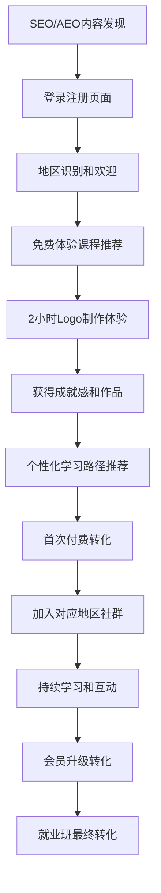

# UAI全球化AI智能设计教育平台产品需求文档（统一版）

## 文档信息

| 文档版本 | 创建时间 | 最后更新 | 作者 | 状态 |
|---------|---------|----------|------|------|
| v5.0 | 2025-08-30 | 2025-08-30 | John (产品经理) | 统一完成 |

---

## 🎯 执行摘要

UAI教育平台（uaiedu.com）专注于构建全球领先的AI辅助设计教育平台，通过**SEO+AEO双引擎优化策略**服务全球简体中文用户群体，结合**7层递进式学习体系**和**AI深度集成技术**，打造从零基础到职业设计师的完整教育服务生态。

**核心战略要点**：
- **技术架构**：Vue 3 + Django 5.2现代化全栈架构，深度集成AI工具
- **市场定位**：服务全球简体中文用户（大陆25-40岁成人+海外华人群体）
- **优化策略**：百度AEO问答优化+Google SEO并行，实现双引擎流量获取
- **商业目标**：年营收1000万+，ROI 6.3x，海外用户贡献40%收入
- **竞争优势**：AI工具深度整合+全球华人专业服务+完整学习体系

---

## 1. 产品概述与市场定位

### 1.1 产品定位

**UAI教育平台（uaiedu.com）**：
- **核心定位**：全球化AI智能辅助设计教育专业平台
- **目标用户**：全球简体中文用户（大陆成人转型学员+海外华人+留学生群体）
- **服务范围**：从零基础体验到职业设计师就业的完整教育链条
- **技术特色**：深度集成Adobe Firefly、Midjourney等AI工具的教学体系

### 1.2 核心价值主张

**教育创新价值**：
- **7层递进式学习体系**：体验→入门→精进→实战→项目落地→会员专区→就业班
- **AI赋能设计教育**：将AI工具深度整合到教学中，降低学习门槛
- **实战项目导向**：以商业项目为案例，培养实用设计技能
- **个性化学习路径**：基于用户画像的智能推荐和学习规划

**技术创新价值**：
- **AI工具深度集成**：不仅介绍工具，更提供工作流整合和实战应用
- **智能学习系统**：AI辅助的作品评价和改进建议
- **跨平台体验**：统一的学习体验，支持移动端和桌面端
- **全球化技术架构**：CDN优化保证全球用户访问体验

**市场服务价值**：
- **全球华人专业服务**：深入理解不同地区华人用户的需求差异
- **跨境商业视野**：结合大陆和海外商业设计实践
- **职业发展支持**：从技能培训到就业指导的全程服务
- **社区生态建设**：连接全球华人设计师的学习和交流平台

### 1.3 目标用户分析

#### 1.3.1 大陆用户特征（占比60%）
- **人群画像**：25-40岁成人，希望转型或提升平面设计技能
- **学习动机**：职业转型、技能提升、副业创收
- **使用习惯**：移动端为主（75%），快速决策，实用导向
- **付费偏好**：月度订阅，价格敏感度中等，重视性价比
- **社交偏好**：微信群互动，朋友圈分享，社群学习

#### 1.3.2 海外华人用户特征（占比40%）
- **地理分布**：
  - 北美华人群体（40%）：美国西海岸、加拿大主要城市
  - 澳洲华人群体（25%）：悉尼、墨尔本、布里斯班
  - 欧洲华人群体（20%）：英国、德国、荷兰
  - 东南亚华人群体（15%）：新加坡、马来西亚、泰国
- **学习动机**：职业发展、创业准备、文化传承
- **使用习惯**：桌面端优先（55%），深度学习，质量导向
- **付费偏好**：年度订阅，客单价高15-20%，重视服务质量
- **社交偏好**：Discord社区、邮件交流、LinkedIn职业网络

---

## 2. SEO+AEO双引擎优化策略

### 2.1 百度AEO（问答引擎优化）策略

#### 2.1.1 核心问答生态布局

**主要优化目标平台**：
```
百度AI生态 (60%流量)
├── 百度AI伙伴 - 搜索结果直接答案展示
├── 文心一言 - AI对话中的权威引用
├── 百度APP - 语音搜索和智能推荐
└── 度小满 - 金融场景下的设计需求

知识问答平台 (30%流量)  
├── 知乎 - 专业领域问答权威建设
├── 百度知道 - 通用设计问题解答
├── 小红书问答 - 生活化设计场景
└── 悟空问答 - 今日头条生态问答

短视频问答 (10%流量)
├── 抖音搜索 - 短视频+文字问答结合
├── 快手搜索 - 技能教学视频展示
└── 视频号 - 微信生态内容分发
```

#### 2.1.2 核心问答内容矩阵

**学习入门类问答**：
- Q: "零基础如何学Logo设计？完整学习路径是什么？"
- Q: "AI工具在Logo设计中能起到什么作用？"
- Q: "海外华人学Logo设计有什么优势和机会？"
- Q: "Logo设计师的职业发展前景如何？"

**技能实战类问答**：
- Q: "如何用Adobe Firefly快速生成Logo创意？"
- Q: "Midjourney和Illustrator如何配合做Logo设计？"
- Q: "Logo设计的商业流程是怎样的？"
- Q: "如何评价一个Logo设计的商业价值？"

**工具对比类问答**：
- Q: "Adobe Firefly vs Midjourney，哪个更适合Logo设计？"
- Q: "Illustrator和Figma在Logo设计中的优劣对比"
- Q: "免费AI工具能否满足商业Logo设计需求？"

### 2.2 Google SEO策略（海外华人市场）

#### 2.2.1 简体中文关键词策略

**核心关键词集群**：

| 关键词类别 | 核心词汇 | 月搜索量 | 竞争度 | 目标用户 |
|------------|----------|----------|--------|----------|
| **产品核心词** | "AI Logo设计课程" | 3.2K | 中 | 技能学习者 |
| | "在线Logo设计培训" | 5.1K | 高 | 职业转型者 |
| | "AI设计工具教程" | 2.8K | 低 | 工具学习者 |
| **地域相关词** | "北美Logo设计培训" | 680 | 低 | 北美华人 |
| | "澳洲中文设计课程" | 420 | 低 | 澳洲华人 |
| | "海外华人设计师培训" | 1.2K | 中 | 全球华人 |
| **技能相关词** | "Illustrator中文教程" | 8.5K | 高 | 软件学习者 |
| | "Logo设计接单技巧" | 1.8K | 中 | 自由职业者 |

#### 2.2.2 内容SEO架构优化

**网站信息架构**（uaiedu.com）：
```
主域名: uaiedu.com
├── /courses/ (课程体系页面)
│   ├── /courses/experience/ (体验专区)
│   ├── /courses/beginner/ (入门专区)  
│   ├── /courses/advanced/ (精进专区)
│   ├── /courses/professional/ (实战专区)
│   ├── /courses/project/ (项目落地专区)
│   ├── /courses/vip/ (会员专区)
│   └── /courses/career/ (就业班)
├── /tools/ (AI工具集成和教程)
│   ├── /tools/firefly/ (Adobe Firefly专区)
│   ├── /tools/midjourney/ (Midjourney专区)
│   └── /tools/comparison/ (工具对比评测)
├── /blog/ (SEO博客内容)
│   ├── /blog/tutorials/ (教程文章)
│   ├── /blog/industry/ (行业观察)
│   ├── /blog/case-studies/ (案例分析)
│   └── /blog/overseas/ (海外用户专题)
├── /community/ (学员社区)
│   ├── /community/showcase/ (作品展示)
│   ├── /community/success-stories/ (成功案例)
│   └── /community/forum/ (交流论坛)
└── /faq/ (结构化问答专区)
    ├── /faq/learning/ (学习相关问答)
    ├── /faq/tools/ (工具使用问答)
    └── /faq/career/ (职业发展问答)
```

### 2.3 双引擎内容营销策略

#### 2.3.1 百度生态内容策略

**知乎专栏规划** (每周2篇)：
- "2025年AI Logo设计完全指南：从工具选择到商业变现"
- "海外华人设计创业实录：我如何在北美建立设计工作室"
- "Adobe Firefly vs Midjourney：Logo设计师的工具选择指南"

**小红书内容矩阵** (每周3篇)：
- "留学生副业推荐：Logo设计技能如何月入$3000+"
- "AI设计工具深度测评：哪些值得设计师付费订阅"
- "30天Logo设计挑战：从零基础到接到第一单"

#### 2.3.2 Google生态内容策略

**SEO博客文章规划** (每周2篇)：
- "海外华人设计师职业发展完全手册：从技能提升到创业成功"
- "北美/澳洲/欧洲设计市场分析：华人设计师的机会与挑战"
- "AI设计工具海外使用指南：订阅优化和最佳实践"

**YouTube频道内容** (每周1-2个视频)：
- AI Logo设计全流程实战教程（中文讲解+英文字幕）
- 海外华人学员成功案例深度访谈
- 设计工具实操对比和选择建议

---

## 3. 核心功能架构

### 3.1 七层递进式学习体系

```
🎯 体验专区 (免费引流层)
   目标：快速获得设计成就感，建立学习信心
   内容：2小时AI Logo快速制作体验 + 基础软件操作
   转化：获得成就感 → 产生付费学习意愿
   ↓
📚 入门专区 (首次付费转化层)  
   目标：建立Logo设计基础认知和AI工具使用能力
   内容：AI工具应用 + Illustrator基础技巧
   定价：¥299-499，配合新用户7折券
   ↓
🎨 精进专区 (技能深化层)
   目标：提升设计品质和创意水平
   内容：字体设计 + 风格探索 + 色彩理论
   前置：完成入门专区课程
   ↓
⚒️ 实战专区 (商业应用层)
   目标：掌握高级技巧和商业流程
   内容：高级制作技巧 + AI商业应用流程
   特点：真实项目案例 + 客户沟通技巧
   ↓
🏢 项目落地专区 (就业准备层)
   目标：完整商业项目制作能力
   内容：商业Logo全流程 + 创意发想方法
   输出：完整作品集 + 服务流程标准
   ↓
💎 会员专区 (持续价值层)
   目标：高价值实战项目和进阶技能
   权限：仅会员可观看，或非会员高价单独购买
   内容：AI智能Logo速成营、品牌标识工作坊等10+专业课程
   ↓
🎓 就业大型班 (终极转化层)
   目标：培养职业Logo设计师
   内容：成为职业Logo设计师（综合实战课程）
   特点：高价值、长周期、就业指导、作品集建设
```

#### 3.1.1 各专区详细定义

**🎯 体验专区课程设置**：
- **Illustrator快速制作Logo**（2小时核心体验课程）
- **Adobe Firefly AI智能辅助设计体验**（AI工具初体验）
- **PS基础入门**（设计软件基础）
- **Figma基础操作**（现代化设计工具）
- **设计思维入门**（创意思维培养）

**💎 会员专区核心课程**：
- AI智能Logo速成营（4周实战训练）
- AI品牌标识工作坊（企业级项目实战）
- AI创意Logo实验室（前沿技术应用）
- 一小时做出你的AI品牌标志（效率方法论）
- AI+设计思维：从灵感到Logo成品（完整工作流）
- Logo新纪元：AI驱动的品牌设计（行业趋势）
- AI智能商标设计与IP打造（知识产权保护）
- 零基础用AI做企业Logo与VI（企业服务）
- AI Logo提示词全攻略（工程化应用）

### 3.2 会员体系与定价策略

#### 3.2.1 全球化差异定价

| 会员类型 | 大陆定价 | 海外定价 | 课程权益 | 优惠券权益 | 就业班权益 |
|---------|---------|----------|----------|------------|------------|
| **月会员** | ¥129 | $19 | 会员专区无限访问 | 1张7折券(30天有效) | 9折券 |
| **季会员** | ¥229 | $35 | 会员专区无限访问 | 2张7折券(90天有效) | 9折券 |
| **年会员** | ¥799 | $119 | 会员专区无限访问 | 6张7折券(365天有效) | 8折券 |
| **长期会员** | ¥1999 | $299 | 会员专区永久访问 | 12张7折券(每年刷新) | 7折券 |

#### 3.2.2 定价策略逻辑

**汇率优化策略**：
- 海外用户美元定价享受15-20%溢价空间
- 考虑购买力差异，大陆用户人民币定价更具竞争力
- 动态调整机制，根据汇率变化和市场反馈优化定价

**支付方式适配**：
- **大陆用户**：微信支付、支付宝（主推），银联卡
- **海外用户**：Stripe（支持Visa/MasterCard），PayPal

### 3.3 AI工具深度集成

#### 3.3.1 核心AI工具API集成

**Adobe Firefly集成**：
```typescript
// 前端AI工具集成示例
interface FireflyIntegration {
  generateLogo: (prompt: string, style: StyleOptions) => Promise<LogoResult>
  refineDesign: (logoId: string, feedback: string) => Promise<LogoResult>
  exportFormats: (logoId: string) => Promise<ExportOptions>
}

// 实时生成演示
const logoGenerator = {
  realTimeDemo: true,
  batchGeneration: true,
  styleTransfer: true,
  qualityAssessment: true
}
```

**Midjourney Bot集成**：
- Discord Bot API调用
- 创意方向生成和探索
- 风格参考和灵感获取
- 批量创意方案生成

**Stable Diffusion本地部署**：
- 定制化模型训练（Logo特化）
- 离线生成能力
- 企业用户隐私保护
- 成本控制和性能优化

#### 3.3.2 AI辅助教学功能

**智能学习助手**：
- 基于用户描述自动生成Logo创意方向
- AI分析品牌属性推荐配色方案
- 一键转换Logo设计风格（现代、复古、极简等）
- 智能质量评估：AI评分Logo的商业适用性

**个性化推荐系统**：
- 基于学习进度推荐下一步课程
- 根据作品风格推荐相关技能提升
- AI分析学习习惯制定个性化学习计划
- 智能匹配同级别学员形成学习小组

---

## 4. 技术架构与实现

### 4.1 前端技术栈

#### 4.1.1 核心技术架构

```typescript
// 前端技术栈（简化优化版）
Framework: Vue 3.4+ with Composition API + TypeScript
Build Tool: Vite 5.0+ (构建和开发工具)
UI Framework: Bootstrap 5.3.6 (无其他UI库依赖)
State Management: Pinia (现代化状态管理)
HTTP Client: Axios (统一拦截器和错误处理)
Router: Vue Router 4.x (路由管理)

// 移除的复杂性（相比多语言版本）
❌ OpenCC.js (繁简转换)
❌ Vue i18n (国际化)
❌ hreflang标签管理
❌ 多域名同步机制
```

#### 4.1.2 关键实现需求

**性能优化要求**：
- **Core Web Vitals指标**：LCP < 2.5s, FID < 100ms, CLS < 0.1
- **首屏加载时间**：大陆用户 < 1s，海外用户 < 2s
- **代码分割**：路由级别的懒加载，减少初始包大小
- **图片优化**：WebP格式优先，响应式图片加载

**SEO技术实现**：
```vue
<!-- SEO组件系统 -->
<template>
  <SEOHead 
    :title="dynamicTitle"
    :description="seoDescription"
    :keywords="targetKeywords"
    :structuredData="courseSchema"
  />
  <BreadcrumbSEO :breadcrumbs="breadcrumbData" />
  <FAQSection :faqs="courseFAQs" />
</template>
```

**API集成架构**：
```typescript
// src/api/ 完整架构
api/
├── index.ts          // Axios配置和拦截器
├── auth.ts           // JWT认证管理
├── courses.ts        // 课程CRUD操作
├── cart.ts           // 购物车管理
├── orders.ts         // 订单处理
├── membership.ts     // 会员系统
├── analytics.ts      // 数据追踪
├── ai-tools.ts       // AI工具API集成
└── upload.ts         // 文件上传（作品、头像）
```

### 4.2 后端技术栈

#### 4.2.1 核心架构

```python
# 后端技术栈
Framework: Django 5.2 + Python 3.12
API Framework: Django REST Framework 3.14+
Authentication: SimpleJWT (JWT令牌认证)
Database: MySQL 8.4+ (生产) / SQLite (开发)
Cache: Redis 7.0+ (会话存储和缓存)
Task Queue: Celery + Redis (异步任务)
File Storage: 阿里云OSS (大陆) + AWS S3 (海外)

# 优化后的架构优势
✅ 统一用户数据管理
✅ 简化的部署和维护
✅ 集中的SEO优化
✅ 高性能缓存策略
```

#### 4.2.2 API设计规范

**统一响应格式**：
```json
{
  "status": 200,
  "data": {
    "user": {
      "id": 12345,
      "nickname": "AI学习者",
      "membership_level": "年会员",
      "learning_progress": {
        "completed_courses": 5,
        "total_courses": 12,
        "next_recommendation": "精进专区-字体设计"
      }
    }
  },
  "msg": "获取用户信息成功"
}
```

**关键API端点**：
```python
# Django URL配置
urlpatterns = [
    path('api/auth/', include('apps.users.urls')),
    path('api/courses/', include('apps.courses.urls')),
    path('api/cart/', include('apps.cart.urls')),
    path('api/orders/', include('apps.orders.urls')),
    path('api/membership/', include('apps.membership.urls')),
    path('api/ai-tools/', include('apps.ai_tools.urls')),
    path('api/analytics/', include('apps.analytics.urls')),
]
```

### 4.3 AI工具集成技术实现

#### 4.3.1 Adobe Firefly API集成

```python
# Django AI工具服务
class FireflyService:
    def __init__(self):
        self.api_key = settings.ADOBE_FIREFLY_API_KEY
        self.base_url = "https://firefly-api.adobe.io"
    
    async def generate_logo(self, prompt: str, style_options: dict):
        """实时Logo生成"""
        payload = {
            "prompt": prompt,
            "style": style_options,
            "format": "svg",
            "quality": "high"
        }
        
        response = await self.make_api_request("/generate", payload)
        return LogoGenerationResult(
            logo_url=response["url"],
            variations=response["variations"],
            metadata=response["metadata"]
        )
    
    def assess_logo_quality(self, logo_data: bytes) -> QualityScore:
        """AI质量评估"""
        # 调用Adobe AI分析API
        return QualityScore(
            commercial_viability=8.5,
            design_principles=9.2,
            brand_alignment=7.8,
            technical_quality=9.5
        )
```

### 4.4 全球化部署架构

#### 4.4.1 单域名全球优化部署

```yaml
# 部署配置
主域名: uaiedu.com
前端部署: Vercel (全球CDN + Edge Runtime)
后端部署: Railway (Django + MySQL)

CDN配置:
  中国大陆: 
    - 阿里云CDN加速
    - 备案域名优化
    - ICP许可证合规
  海外地区:
    - CloudFlare全球节点
    - AWS CloudFront备选
    - 智能DNS解析

数据库: 
  主库: Railway MySQL 8.4 (Global)
  缓存: Redis分布式缓存
  文件存储: 
    - 大陆用户: 阿里云OSS
    - 海外用户: AWS S3

监控体系:
  性能监控: New Relic APM
  错误追踪: Sentry
  用户行为: 
    - 大陆: 百度统计 + 自建分析
    - 海外: Google Analytics 4
```

---

## 5. 用户体验与界面设计

### 5.1 全球化用户体验设计

#### 5.1.1 统一设计语言

**视觉设计原则**：
- **简体中文统一**：全平台保持一致的语言体验
- **文化包容性**：设计案例兼顾大陆和海外用户文化背景
- **现代化界面**：Bootstrap 5.3.6为基础的清新现代设计风格
- **响应式设计**：移动端优先，确保全设备良好体验

**交互设计原则**：
- **直观易用**：符合用户操作习惯，减少学习成本
- **反馈及时**：操作结果即时可见，Loading状态明确
- **渐进式披露**：复杂功能分步引导，避免信息过载
- **无障碍支持**：支持屏幕阅读器，键盘导航优化

#### 5.1.2 差异化服务体验

**大陆用户体验特色**：
```typescript
// 大陆用户专属功能
const mainlandFeatures = {
  socialIntegration: {
    wechatLogin: true,
    wechatShare: true,
    wechatCommunity: true
  },
  payment: {
    alipay: true,
    wechatPay: true,
    unionPay: true
  },
  content: {
    localCases: true,        // 本土企业案例
    culturalElements: true,   // 中国文化元素
    nationalHolidays: true   // 节假日主题设计
  },
  community: {
    wechatGroups: true,      // 微信学习群
    localMeetups: true       // 线下见面会
  }
}
```

**海外用户体验特色**：
```typescript
// 海外用户专属功能
const overseasFeatures = {
  socialIntegration: {
    discordCommunity: true,
    linkedinShare: true,
    emailMarketing: true
  },
  payment: {
    stripe: true,
    paypal: true,
    applePay: true,
    googlePay: true
  },
  content: {
    crossCulturalCases: true,    // 跨文化设计案例
    internationalBrands: true,   // 国际品牌分析
    localMarketInsights: true    // 当地市场洞察
  },
  services: {
    timezoneSupport: true,       // 时区适配
    multiCurrencyDisplay: true,  // 多币种显示
    internationalShipping: true // 国际物流
  }
}
```

### 5.2 核心用户旅程设计

#### 5.2.1 新用户获客旅程



#### 5.2.2 关键转化节点优化

**首次访问体验**（0-30秒）：
- 自动识别用户地理位置，显示相关内容
- 清晰的价值主张展示："90天从零基础到接单变现"
- 显著的免费体验入口："立即免费制作第一个Logo"
- 社会证明展示：学员作品、成功案例、用户评价

**免费体验优化**（体验课程期间）：
- 逐步引导完成Logo制作流程
- 实时成就反馈和进度可视化
- AI工具效果的"惊喜时刻"设计
- 体验结束后的成果展示和分享功能

**付费转化优化**（体验后24小时）：
- 个性化的学习路径推荐
- 限时优惠和新用户专属礼包
- 明确的"下一步学什么"指导
- 同期学员的学习进度对比激励

### 5.3 AI功能用户体验设计

#### 5.3.1 AI工具交互设计

**Logo生成器界面**：
```vue
<template>
  <div class="ai-logo-generator">
    <!-- 输入区域 -->
    <div class="prompt-input">
      <textarea 
        v-model="userPrompt"
        placeholder="描述您想要的Logo风格，例如：科技感的蓝色Logo，包含闪电元素，现代极简风格"
        class="form-control"
      />
      <div class="style-options">
        <StyleSelector v-model="selectedStyle" />
        <ColorPalette v-model="colorScheme" />
        <IndustrySelector v-model="industry" />
      </div>
    </div>
    
    <!-- 生成按钮 -->
    <button @click="generateLogo" class="btn btn-primary btn-lg">
      <span v-if="!generating">AI生成Logo</span>
      <span v-else>AI正在创作中...</span>
    </button>
    
    <!-- 结果展示 -->
    <div class="generation-results" v-if="logoResults.length">
      <LogoCard 
        v-for="logo in logoResults" 
        :key="logo.id"
        :logo="logo"
        @refine="refineLogo"
        @download="downloadLogo"
      />
    </div>
  </div>
</template>
```

**智能评分系统**：
- 实时质量评分（1-10分）
- 商业适用性分析
- 改进建议自动生成
- 同类型优秀案例推荐

---

## 6. 电商交易系统

### 6.1 购物车与订单系统

#### 6.1.1 购物车功能设计

**购物车核心功能**：
```typescript
interface ShoppingCart {
  items: CartItem[]
  subtotal: number
  appliedCoupons: Coupon[]
  finalPrice: number
  
  // 核心方法
  addCourse(courseId: string, quantity?: number): void
  removeCourse(courseId: string): void
  applyCoupon(couponCode: string): Promise<CouponResult>
  calculateTotal(): PriceCalculation
}

// 价格计算逻辑
const priceCalculation = {
  originalPrice: 1299,      // 原价
  memberDiscount: -200,     // 会员折扣
  couponDiscount: -300,     // 优惠券折扣
  finalPrice: 799,          // 最终价格
  savings: 500              // 总节省
}
```

**购物车用户体验优化**：
- 添加商品时的动画效果确认
- 实时价格计算和优惠展示
- 一键清空和批量操作功能
- 购物车内容持久化保存（7天有效期）
- 移动端侧滑操作和手势优化

#### 6.1.2 订单支付流程

**支付方式全球化适配**：
```typescript
// 支付方式配置
const paymentMethods = {
  mainland: {
    primary: ['alipay', 'wechatPay'],
    secondary: ['unionPay', 'creditCard'],
    currency: 'CNY'
  },
  overseas: {
    primary: ['stripe', 'paypal'],
    secondary: ['applePay', 'googlePay'],
    currency: 'USD'
  }
}
```

**订单确认页面功能**：
- 商品信息和价格明细确认
- 可用优惠券智能推荐和一键应用
- 支付方式选择和风险提示
- 订单倒计时（15分钟支付限制）
- 发票信息填写和电子发票生成

### 6.2 会员权益系统

#### 6.2.1 会员权益管理

**权益体系设计**：
```typescript
interface MembershipBenefits {
  courseAccess: {
    vipCourses: boolean
    downloadPermission: boolean
    offlineViewing: boolean
  }
  
  discounts: {
    regularCourseDiscount: number  // 普通课程折扣
    careerClassDiscount: number    // 就业班折扣
    toolSubscriptionDiscount: number // 工具订阅折扣
  }
  
  services: {
    prioritySupport: boolean       // 优先客服
    personalConsultation: boolean  // 一对一咨询
    portfolioReview: boolean       // 作品集点评
    jobReferral: boolean          // 就业推荐
  }
  
  community: {
    exclusiveForum: boolean        // 会员专属论坛
    monthlyWebinar: boolean        // 月度专家讲座
    networkingEvents: boolean      // 行业交流活动
  }
}
```

#### 6.2.2 优惠券策略系统

**优惠券类型和使用规则**：

| 优惠券类型 | 获得方式 | 使用规则 | 有效期 | 防套利机制 |
|------------|----------|----------|--------|------------|
| **注册礼包券** | 完成手机验证 | 7折优惠，首次购买专用 | 7天 | 仅新用户，限用1次 |
| **首课完成券** | 完成首门课程90%+ | 7折优惠，普通课程适用 | 3天 | 限课程完成度验证 |
| **会员权益券** | 购买会员获得 | 数量和有效期与会员等级关联 | 同会员期 | 与会员账号绑定 |
| **积分兑换券** | 积分系统兑换 | 满减券，阶梯式优惠 | 30天 | 积分清零机制控制 |
| **节日活动券** | 活动期间发放 | 限时限量，特定课程适用 | 活动期 | 库存控制 |

**积分系统设计**：
```typescript
const pointsSystem = {
  earning: {
    dailyCheckin: 10,           // 每日签到
    courseComplete: 50,         // 完成课程
    
  },
  
  redemption: {
    coupon_100_10: 100,         // 100积分 = 满100减10券
    coupon_200_25: 200,         // 200积分 = 满200减25券
    coupon_500_70: 500,         // 500积分 = 满500减70券
  },
  
  limitations: {
    maxDailyPoints: 100,        // 每日积分上限
    monthlyRedemptionLimit: 1,  // 月度兑换限制
    yearlyReset: true           // 年底积分清零
  }
}
```

---

## 7. 社区与用户运营

### 7.1 全球化社区建设

#### 7.1.1 多平台社区矩阵

**大陆用户社区**：
```typescript
const mainlandCommunity = {
  wechatGroups: {
    beginnerGroup: "Logo设计入门交流群",
    advancedGroup: "AI设计实战进阶群", 
    careerGroup: "设计师就业指导群",
    vipGroup: "会员专属讨论群"
  },
  
  wechatOfficialAccount: {
    contentType: ["教程文章", "行业资讯", "学员作品"],
    publishFrequency: "每周3篇",
    interactionFeatures: ["在线答疑", "作品点评", "活动报名"]
  },
  
  xiaohongshu: {
    contentFocus: ["设计技巧", "学习心得", "作品展示"],
    hashtagStrategy: ["#Logo设计", "#AI设计", "#职业转型"],
    influencerCollaboration: true
  }
}
```

**海外用户社区**：
```typescript
const overseasCommunity = {
  discordServer: {
    channels: {
      general: "General Discussion",
      showcase: "Portfolio Showcase", 
      feedback: "Design Feedback",
      career: "Career Development",
      aiTools: "AI Tools Discussion"
    },
    features: ["语音聊天", "屏幕共享", "文件分享", "机器人助手"]
  },
  
  linkedin: {
    contentType: ["行业观察", "职业发展", "技术分享"],
    networkingEvents: "月度在线meetup",
    thoughtLeadership: true
  },
  
  youtube: {
    contentSchedule: "每周2个视频",
    contentTypes: ["教程", "案例分析", "工具评测", "学员访谈"],
    liveStreaming: "双周直播答疑"
  }
}
```

#### 7.1.2 社区运营策略

**内容创作激励机制**：
- **学员作品展示**：每周精选优秀作品在官方渠道展示
- **设计挑战赛**：月度主题设计比赛，获奖者获得课程奖励
- **经验分享奖励**：分享学习心得获得积分和优惠券
- **推荐奖励**：成功推荐新学员获得现金返利

**社区管理规范**：
```typescript
const communityGuidelines = {
  contentPolicy: {
    allowed: ["原创设计作品", "学习心得", "技术讨论", "建设性反馈"],
    prohibited: ["广告推广", "侵权作品", "恶意批评", "政治敏感内容"]
  },
  
  moderationSystem: {
    autoModeration: true,        // AI自动审核
    humanReview: true,           // 人工复审
    reportingSystem: true,       // 用户举报
    appealProcess: true          // 申诉流程
  },
  
  rewardSystem: {
    activeParticipation: "积分奖励",
    qualityContent: "优惠券奖励", 
    mentorship: "会员权益奖励",
    eventOrganization: "现金奖励"
  }
}
```

### 7.2 用户生命周期管理

#### 7.2.1 用户分层运营

**用户分层策略**：
```typescript
const userSegmentation = {
  newUsers: {
    definition: "注册后30天内",
    goals: ["完成首次体验", "首次付费转化"],
    tactics: ["新手引导", "专属优惠", "1v1咨询"],
    kpi: ["激活率>60%", "转化率>25%"]
  },
  
  activeUsers: {
    definition: "有付费行为且30天内活跃",
    goals: ["提升学习完成率", "促进会员转化"],
    tactics: ["学习督导", "进度奖励", "社群互动"],
    kpi: ["完课率>70%", "会员转化率>15%"]
  },
  
  vipMembers: {
    definition: "会员用户",
    goals: ["提升满意度", "促进续费", "口碑传播"],
    tactics: ["专属服务", "高级课程", "线下活动"],
    kpi: ["满意度>85%", "续费率>60%", "NPS>70"]
  },
  
  dormantUsers: {
    definition: "30天未活跃的付费用户",
    goals: ["重新激活", "挽回流失"],
    tactics: ["专属优惠", "新课程推荐", "1v1回访"],
    kpi: ["激活率>20%", "回流转化率>10%"]
  }
}
```

#### 7.2.2 营销自动化流程

**邮件营销序列**（海外用户）：
```typescript
const emailMarketingFlow = {
  welcomeSeries: [
    {
      trigger: "注册完成",
      delay: "立即",
      subject: "欢迎加入UAI设计学院！开始您的AI设计之旅",
      content: "账户激活 + 免费体验课程推荐"
    },
    {
      trigger: "注册后3天未活跃", 
      delay: "3天",
      subject: "还没开始学习？这里有一些灵感给您",
      content: "学员作品展示 + 学习方法指导"
    },
    {
      trigger: "注册后7天未付费",
      delay: "7天", 
      subject: "限时优惠：新用户专享7折课程",
      content: "个性化课程推荐 + 新用户优惠券"
    }
  ],
  
  engagementSeries: [
    {
      trigger: "课程进度50%",
      subject: "您已完成一半课程！继续加油",
      content: "学习进度展示 + 下一步学习建议"
    },
    {
      trigger: "课程完成",
      subject: "恭喜完成课程！获得您的成就证书",
      content: "电子证书 + 下一阶段课程推荐"
    }
  ]
}
```

**微信营销序列**（大陆用户）：
```typescript
const wechatMarketingFlow = {
  officialAccountFlow: [
    {
      trigger: "关注公众号",
      response: "欢迎消息 + 免费资料包",
      followUp: "新用户专属福利推送"
    },
    {
      trigger: "7天未互动",
      response: "精选教程推送 + 学习群邀请",
      followUp: "个性化内容推荐"
    }
  ],
  
  communityGroupFlow: [
    {
      trigger: "加入学习群",
      action: "群欢迎 + 学习资料分享",
      schedule: "每日打卡提醒 + 答疑时间通知"
    },
    {
      trigger: "作业提交",
      action: "点评反馈 + 优秀作品展示",
      reward: "积分奖励 + 进阶课程推荐"
    }
  ]
}
```

---

## 8. 数据分析与监控体系

### 8.1 核心KPI指标体系

#### 8.1.1 业务核心指标

**用户增长指标**：
```typescript
const growthMetrics = {
  acquisition: {
    newUserRegistration: {
      target: "1000+/月",
      breakdown: {
        mainland: "600+/月", 
        overseas: "400+/月"
      }
    },
    organicTrafficGrowth: {
      target: "30%/季度",
      sources: ["SEO", "AEO", "Social", "Direct"]
    },
    conversionFunnel: {
      visitToRegister: ">15%",
      registerToFirstPurchase: ">25%", 
      freeToVip: ">12%",
      vipRenewal: ">60%"
    }
  },
  
  engagement: {
    monthlyActiveUsers: {
      target: "8000+",
      retention: {
        day7: ">40%",
        day30: ">20%", 
        day90: ">15%"
      }
    },
    courseCompletion: {
      target: ">70%",
      byLevel: {
        experience: ">85%",
        beginner: ">75%",
        advanced: ">60%"
      }
    }
  }
}
```

**商业化指标**：
```typescript
const revenueMetrics = {
  monthly: {
    totalRevenue: {
      target: "¥800K+",
      breakdown: {
        mainland: "¥500K+",
        overseas: "¥300K+"
      }
    },
    arpu: {
      target: "¥280+",
      bySegment: {
        mainland: "¥220+",
        overseas: "$65+"
      }
    }
  },
  
  annual: {
    totalRevenue: "¥10M+",
    ltv: "¥1200+",
    cac: "<¥300",
    roi: "6.3x+",
    profitMargin: ">35%"
  }
}
```

#### 8.1.2 SEO+AEO效果指标

**搜索引擎优化指标**：
```typescript
const seoMetrics = {
  baidu: {
    keywordRankings: {
      top10Keywords: ">60%",
      top3Keywords: ">30%",
      brandedSearchShare: ">80%"
    },
    aeoPerformance: {
      aiPartnerMentions: "2000+/月",
      zhihuAnswerViews: "100万+/月",
      faqSnippetCapture: ">40%"
    },
    trafficMetrics: {
      organicUV: "30K+/月",
      conversionRate: ">8%",
      bounceRate: "<45%"
    }
  },
  
  google: {
    keywordRankings: {
      targetKeywords: ">50% in top10",
      longTailKeywords: ">70% in top10",
      localizedKeywords: ">60% in top10"
    },
    trafficMetrics: {
      organicUV: "20K+/月",
      conversionRate: ">6%",
      avgSessionDuration: ">3min"
    }
  }
}
```

### 8.2 数据收集与分析系统

#### 8.2.1 事件追踪体系

**用户行为事件定义**：
```typescript
const trackingEvents = {
  userJourney: {
    'user.register': {
      properties: ['source', 'device', 'region'],
      description: '用户注册完成'
    },
    'user.firstLogin': {
      properties: ['loginMethod', 'timeSinceRegistration'],
      description: '首次登录'
    },
    'user.profileComplete': {
      properties: ['completionFields', 'completionTime'],
      description: '完善个人资料'
    }
  },
  
  learningBehavior: {
    'course.start': {
      properties: ['courseId', 'courseLevel', 'source'],
      description: '开始学习课程'
    },
    'course.progress': {
      properties: ['courseId', 'progressPercent', 'timeSpent'],
      description: '学习进度更新'
    },
    'course.complete': {
      properties: ['courseId', 'completionTime', 'finalScore'],
      description: '完成课程学习'
    },
    'assignment.submit': {
      properties: ['courseId', 'assignmentId', 'submissionType'],
      description: '提交作业'
    }
  },
  
  commercialization: {
    'cart.add': {
      properties: ['courseId', 'price', 'source'],
      description: '添加到购物车'
    },
    'order.create': {
      properties: ['orderId', 'totalAmount', 'itemCount'],
      description: '创建订单'
    },
    'payment.success': {
      properties: ['orderId', 'paymentMethod', 'amount'],
      description: '支付成功'
    },
    'membership.purchase': {
      properties: ['membershipType', 'duration', 'discount'],
      description: '购买会员'
    }
  },
  
  aiToolUsage: {
    'ai.logoGenerate': {
      properties: ['toolType', 'promptLength', 'styleOptions'],
      description: 'AI生成Logo'
    },
    'ai.qualityAssess': {
      properties: ['logoId', 'aiScore', 'assessmentTime'],
      description: 'AI质量评估'
    }
  }
}
```

#### 8.2.2 数据分析架构

**分析平台集成**：
```python
# Django Analytics Service
class UnifiedAnalyticsService:
    def __init__(self):
        self.baidu_analytics = BaiduAnalyticsAPI()
        self.google_analytics = GoogleAnalyticsAPI()
        self.custom_analytics = CustomAnalyticsEngine()
        
    def track_user_event(self, user_id: str, event: str, properties: dict):
        """统一事件追踪"""
        # 本地数据存储（用于业务分析）
        self.custom_analytics.record_event(user_id, event, properties)
        
        # 第三方平台同步
        if self.is_mainland_user(user_id):
            self.baidu_analytics.track_event(event, properties)
        else:
            self.google_analytics.track_event(event, properties)
            
    def generate_dashboard_data(self) -> AnalyticsDashboard:
        """生成实时数据大屏"""
        return AnalyticsDashboard(
            realtime_metrics=self.get_realtime_metrics(),
            conversion_funnel=self.analyze_conversion_funnel(),
            user_segmentation=self.analyze_user_segments(),
            revenue_analytics=self.analyze_revenue_metrics(),
            seo_performance=self.analyze_seo_performance()
        )
```

### 8.3 商业智能与决策支持

#### 8.3.1 数据驱动决策流程

**A/B测试框架**：
```typescript
const abTestingStrategy = {
  landingPageOptimization: {
    testName: "首页转化率优化",
    variants: {
      control: "当前首页设计",
      variant1: "突出AI功能特色",
      variant2: "强调就业成功率"
    },
    metrics: ["注册转化率", "免费课程完成率"],
    sampleSize: "每组1000用户",
    duration: "4周"
  },
  
  pricingPageOptimization: {
    testName: "定价页面优化",
    variants: {
      control: "当前定价策略",
      variant1: "年付优惠加大",
      variant2: "分期付款选项"
    },
    metrics: ["付费转化率", "客单价", "退费率"],
    sampleSize: "每组800用户",
    duration: "6周"
  }
}
```

**预测分析模型**：
```python
class PredictiveAnalytics:
    def predict_user_churn(self, user_id: str) -> ChurnPrediction:
        """用户流失预测"""
        user_features = self.extract_user_features(user_id)
        churn_probability = self.churn_model.predict(user_features)
        
        return ChurnPrediction(
            probability=churn_probability,
            risk_factors=self.identify_risk_factors(user_features),
            retention_suggestions=self.generate_retention_strategy(user_features)
        )
        
    def forecast_revenue(self, period: str) -> RevenueForecast:
        """收入预测"""
        historical_data = self.get_historical_revenue(period)
        seasonal_factors = self.analyze_seasonality()
        market_trends = self.analyze_market_trends()
        
        return RevenueForecast(
            predicted_revenue=self.revenue_model.predict(
                historical_data, seasonal_factors, market_trends
            ),
            confidence_interval=self.calculate_confidence_interval(),
            key_assumptions=self.list_key_assumptions()
        )
```

---

## 9. 风险评估与应对策略

### 9.1 技术风险

#### 9.1.1 AI工具依赖风险

**风险描述**：
- 第三方AI工具API限制、价格上涨或服务中断
- Adobe Firefly、Midjourney等工具政策变化
- AI生成内容的版权和合规风险

**应对策略**：
```typescript
const aiToolRiskMitigation = {
  diversification: {
    primaryTools: ['Adobe Firefly', 'Midjourney'],
    backupTools: ['Stable Diffusion', 'DALL-E 2'],
    selfHostedOptions: ['Stable Diffusion本地部署']
  },
  
  costControl: {
    budgetAlerts: true,
    usageMonitoring: true,
    costOptimization: '批量处理+缓存策略',
    contractNegotiation: '年度合约价格锁定'
  },
  
  complianceManagement: {
    contentReview: 'AI生成内容人工审核',
    copyrightCheck: '版权风险自动检测',
    userAgreement: '明确AI工具使用条款',
    legalConsultation: '定期法务合规咨询'
  }
}
```

#### 9.1.2 系统稳定性风险

**风险描述**：
- 用户增长导致的系统性能瓶颈
- 全球化部署的网络稳定性问题
- 数据安全和隐私保护风险

**技术风险应对方案**：
```python
# 系统稳定性保障方案
class SystemReliability:
    def __init__(self):
        self.monitoring = SystemMonitoring()
        self.scaling = AutoScaling()
        self.backup = BackupStrategy()
        
    def performance_monitoring(self):
        """性能监控体系"""
        return {
            'realtime_metrics': [
                '响应时间', 'QPS', '错误率', 'CPU使用率', '内存使用率'
            ],
            'alerting_rules': {
                'response_time > 2s': 'warning',
                'error_rate > 1%': 'critical', 
                'cpu_usage > 80%': 'warning'
            },
            'auto_scaling': {
                'frontend': 'Vercel自动扩容',
                'backend': 'Railway自动扩容',
                'database': 'MySQL读写分离+连接池'
            }
        }
        
    def disaster_recovery(self):
        """灾难恢复预案"""
        return {
            'backup_strategy': {
                'database': '每日全量备份+实时增量',
                'files': '多云存储冗余',
                'code': 'Git多仓库备份'
            },
            'recovery_procedures': {
                'rto': '< 30分钟',  # 恢复时间目标
                'rpo': '< 5分钟',   # 恢复点目标
                'failover': '自动故障转移机制'
            }
        }
```

### 9.2 市场竞争风险

#### 9.2.1 竞争格局变化风险

**风险描述**：
- 大型教育平台进入AI设计细分市场
- 新兴AI工具厂商推出教育产品
- 免费AI工具普及降低付费意愿

**竞争应对策略**：
```typescript
const competitiveStrategy = {
  differentiation: {
    coreAdvantages: [
      '全球华人专业服务',
      '7层完整学习体系',
      'AI工具深度集成',
      '就业导向培训'
    ],
    continuousInnovation: [
      '新AI工具快速集成',
      '教学方法论持续优化', 
      '行业案例库定期更新',
      '师资团队专业提升'
    ]
  },
  
  moatBuilding: {
    contentAssets: '原创教程内容版权保护',
    userCommunity: '活跃学员社区生态',
    brandRecognition: 'AI设计教育思想领导力',
    partnerNetwork: 'AI工具厂商战略合作'
  },
  
  rapidResponse: {
    competitorMonitoring: '竞品动态实时监控',
    featureParity: '关键功能快速跟进',
    pricingFlexibility: '灵活定价策略调整',
    marketingAgility: '营销策略快速迭代'
  }
}
```

#### 9.2.2 搜索算法变化风险

**风险描述**：
- 百度、Google搜索算法更新影响排名
- AEO问答算法变化影响流量获取
- 新兴搜索平台崛起分散流量

**SEO/AEO风险应对**：
```typescript
const seoRiskMitigation = {
  algorithmAdaptation: {
    whitehhatSEO: '纯白帽SEO策略，内容质量为王',
    diversifiedKeywords: '长尾关键词+语义关键词布局',
    contentDepth: '深度专业内容建设',
    userExperience: 'Core Web Vitals持续优化'
  },
  
  trafficDiversification: {
    organicSearch: '60% - SEO+AEO双引擎',
    socialMedia: '25% - 社交媒体营销',
    directTraffic: '10% - 品牌知名度建设',
    paidTraffic: '5% - 精准付费广告'
  },
  
  emergingPlatforms: {
    monitoring: '新兴搜索平台流量监控',
    earlyAdoption: '新平台早期布局策略',
    contentRepurposing: '内容多平台适配发布'
  }
}
```

### 9.3 合规与法律风险

#### 9.3.1 跨境服务合规

**合规风险点**：
- 大陆用户数据保护和网络安全法
- 海外用户GDPR、CCPA等隐私法规
- AI生成内容的版权和责任界定
- 跨境支付和税务合规

**合规管理策略**：
```typescript
const complianceStrategy = {
  dataProtection: {
    mainland: {
      regulations: ['网络安全法', '数据安全法', '个人信息保护法'],
      implementation: [
        '数据本地化存储',
        '用户同意机制完善', 
        '数据处理活动记录',
        '安全评估定期进行'
      ]
    },
    overseas: {
      regulations: ['GDPR', 'CCPA', 'PIPEDA'],
      implementation: [
        'Cookie同意横幅',
        '数据处理合法依据',
        '用户权利保障机制',
        '数据跨境传输合规'
      ]
    }
  },
  
  contentCompliance: {
    aiGeneratedContent: [
      'AI生成内容明确标识',
      '版权风险提示和免责',
      '用户协议明确责任界定',
      '内容审核和过滤机制'
    ],
    educationalContent: [
      '教育资质申请',
      '师资资格认证',
      '课程内容合规审查',
      '学员权益保护措施'
    ]
  },
  
  financialCompliance: {
    paymentProcessing: [
      'PCI DSS安全认证',
      '反洗钱AML合规',
      '支付安全风控',
      '交易记录完整保存'
    ],
    taxCompliance: [
      '增值税合规处理',
      '跨境税收协定适用',
      '收入确认原则遵循',
      '税务申报及时准确'
    ]
  }
}
```

---

## 10. 实施路线图与里程碑

### 10.1 分阶段实施计划

#### 10.1.1 Phase 1: 基础建设与优化 (Month 1-3)

**技术基础建设**：
```typescript
const phase1Technical = {
  frontend: {
    tasks: [
      '完整API集成层开发 (src/api/)',
      'SEO组件系统建设',
      '状态管理系统完善',
      '性能优化和CDN配置'
    ],
    deliverables: [
      'API服务层100%覆盖',
      'SEO技术指标达标',
      '页面加载速度提升20%',
      'TypeScript覆盖率90%+'
    ]
  },
  
  backend: {
    tasks: [
      'AI工具API集成开发',
      '全球化支付系统集成',
      '用户行为追踪系统',
      '数据分析基础架构'
    ],
    deliverables: [
     
      '支付宝+Stripe双支付支持',
      '事件追踪系统上线',
      '实时数据大屏功能'
    ]
  }
}
```

**内容建设计划**：
```typescript
const phase1Content = {
  seoAeoContent: {
    target: '建立SEO+AEO内容基础',
    deliverables: [
      '核心100个FAQ问答创作完成',
      '知乎专栏发布15篇专业文章',
      '小红书账号建立+30篇内容发布',
      'YouTube频道创建+10个教程视频'
    ]
  },
  
  courseContent: {
    target: '完善核心课程体系',
    deliverables: [
      '7层学习体系课程内容补全',
      'AI工具集成演示课程制作',
      '实战项目案例库建设(20个案例)',
      '学员作品展示系统上线'
    ]
  }
}
```

**Phase 1 成功指标**：
- 网站Core Web Vitals全面达标
- SEO关键词Top10排名占比达到30%
- 用户注册转化率达到15%
- 系统稳定性99.5%+

#### 10.1.2 Phase 2: 用户增长与转化优化 (Month 3-6)

**用户增长策略**：
```typescript
const phase2Growth = {
  trafficAcquisition: {
    seoTrafficTarget: '月UV 30K+',
    socialMediaTarget: '社交媒体月增长25%',
    paidAdvertisingROI: '投入产出比 > 3:1',
    referralProgramLaunch: '推荐奖励机制上线'
  },
  
  conversionOptimization: {
    funnelOptimization: '转化漏斗各环节优化',
    abTestingProgram: 'A/B测试系统化运行',
    personalizationEngine: '个性化推荐系统上线',
    retentionCampaigns: '用户留存营销活动'
  }
}
```

**商业化提升**：
```typescript
const phase2Monetization = {
  membershipProgram: {
    target: '会员体系优化和推广',
    initiatives: [
      '会员权益包装和营销',
      '会员续费流程优化',
      '会员专属服务上线',
      '会员推荐计划启动'
    ]
  },
  
  careerPrograms: {
    target: '就业班产品正式推出',
    initiatives: [
      '就业班课程体系完善',
      '企业合作伙伴关系建立',
      '就业成功案例包装推广',
      '就业服务流程标准化'
    ]
  }
}
```

**Phase 2 成功指标**：
- 月活跃用户达到8,000+
- 付费转化率达到12%+
- 月营收达到¥50万+
- 会员续费率达到50%+

#### 10.1.3 Phase 3: 规模化与品牌建设 (Month 6-12)

**规模化运营**：
```typescript
const phase3Scaling = {
  contentScaling: {
    contentProductionVolume: '每周20篇优质内容',
    multiChannelDistribution: '全渠道内容分发矩阵',
    communityUGC: '用户生成内容激励机制',
    thoughtLeadership: '行业影响力和话语权建设'
  },
  
  operationalExcellence: {
    automationSystems: '运营流程自动化升级',
    dataAnalyticsMature: '数据分析和预测能力成熟',
    customerService: '7x24客服体系建设',
    qualityAssurance: '教学质量保证体系完善'
  }
}
```

**品牌影响力建设**：
```typescript
const phase3Branding = {
  industryRecognition: {
    targets: [
      'AI设计教育领域Top3品牌地位',
      '行业会议演讲和媒体专访',
      '权威奖项申请和获得',
      '行业标准制定参与'
    ]
  },
  
  globalExpansion: {
    marketPenetration: '海外市场深度渗透',
    localPartnership: '海外本地化合作伙伴',
    culturalAdaptation: '多文化设计案例库',
    crossBorderSynergy: '跨境商业协同效应'
  }
}
```

**Phase 3 成功指标**：
- 年营收突破¥1000万
- 海外用户收入占比达到40%
- 注册用户总数突破100,000
- 行业品牌认知度Top3

### 10.2 关键里程碑验证

#### 10.2.1 技术里程碑

```typescript
const technicalMilestones = {
  month1: {
    milestone: 'AI工具集成MVP完成',
    criteria: [
      
      'Logo生成功能上线测试',
      '质量评估系统基础版本',
      'API响应时间<2秒'
    ]
  },
  
  month3: {
    milestone: '全球化技术架构完成',
    criteria: [
      'CDN全球部署优化完成',
      '双支付系统稳定运行',
      'SEO技术指标全面达标',
      '系统可用性>99.5%'
    ]
  },
  
  month6: {
    milestone: '数据驱动运营系统成熟',
    criteria: [
      '实时数据大屏全功能上线',
      'A/B测试平台稳定运行',
      '用户画像系统精准度>85%',
      '预测模型准确率>80%'
    ]
  }
}
```

#### 10.2.2 商业里程碑

```typescript
const businessMilestones = {
  month2: {
    milestone: '首批付费用户获得',
    criteria: [
      '付费用户数>100',
      '首批用户满意度>80%',
      '课程完成率>60%',
      'NPS评分>50'
    ]
  },
  
  month4: {
    milestone: '会员体系商业验证',
    criteria: [
      '会员用户数>500',
      '会员贡献收入占比>30%',
      '会员续费率>40%', 
      '会员推荐转化率>20%'
    ]
  },
  
  month8: {
    milestone: '就业班产品成功验证',
    criteria: [
      '就业班学员数>50',
      '就业成功率>80%',
      '就业班满意度>90%',
      '就业班ROI>10x'
    ]
  },
  
  month12: {
    milestone: '商业目标全面达成',
    criteria: [
      '年营收¥1000万+',
      '用户总数10万+',
      '海外收入占比40%+',
      '整体ROI 6.3x+'
    ]
  }
}
```

---

## 11. 预算规划与资源配置

### 11.1 年度预算分配

#### 11.1.1 营销推广预算

| 预算类别 | Q1 | Q2 | Q3 | Q4 | 年度总计 | ROI预期 |
|----------|----|----|----|----|----------|---------|
| **SEO+AEO内容建设** | ¥80K | ¥100K | ¥120K | ¥100K | ¥400K | 5.2x |
| **社交媒体运营** | ¥50K | ¥60K | ¥70K | ¥60K | ¥240K | 6.8x |
| **付费广告投放** | ¥100K | ¥120K | ¥150K | ¥130K | ¥500K | 4.0x |
| **KOL合作推广** | ¥40K | ¥50K | ¥60K | ¥50K | ¥200K | 5.5x |
| **线下活动/展会** | ¥30K | ¥40K | ¥50K | ¥40K | ¥160K | 3.8x |
| **营销工具/软件** | ¥20K | ¥25K | ¥30K | ¥25K | ¥100K | - |
| **总计** | ¥320K | ¥395K | ¥480K | ¥405K | ¥1600K | 5.1x |

#### 11.1.2 技术开发预算

| 预算类别 | Q1 | Q2 | Q3 | Q4 | 年度总计 |
|----------|----|----|----|----|----------|
| **AI工具集成开发** | ¥120K | ¥80K | ¥60K | ¥40K | ¥300K |
| **平台功能开发** | ¥100K | ¥80K | ¥70K | ¥50K | ¥300K |
| **SEO技术优化** | ¥40K | ¥30K | ¥25K | ¥15K | ¥110K |
| **数据分析系统** | ¥60K | ¥40K | ¥30K | ¥20K | ¥150K |
| **第三方服务费** | ¥50K | ¥55K | ¥60K | ¥65K | ¥230K |
| **总计** | ¥370K | ¥285K | ¥245K | ¥190K | ¥1090K |

#### 11.1.3 运营成本预算

| 预算类别 | Q1 | Q2 | Q3 | Q4 | 年度总计 |
|----------|----|----|----|----|----------|
| **人力成本** | ¥300K | ¥320K | ¥340K | ¥360K | ¥1320K |
| **内容创作成本** | ¥80K | ¥90K | ¥100K | ¥90K | ¥360K |
| **客户服务成本** | ¥40K | ¥45K | ¥50K | ¥45K | ¥180K |
| **办公及管理费用** | ¥60K | ¥65K | ¥70K | ¥65K | ¥260K |
| **总计** | ¥480K | ¥520K | ¥560K | ¥560K | ¥2120K |

### 11.2 团队组织架构

#### 11.2.1 核心团队配置

```typescript
const teamStructure = {
  leadership: {
    productDirector: {
      count: 1,
      responsibility: '产品战略和全球化业务决策',
      salary: '¥25K/月'
    }
  },
  
  marketing: {
    seoAeoManager: {
      count: 1, 
      responsibility: 'SEO+AEO双引擎优化策略执行',
      salary: '¥18K/月'
    },
    contentTeam: {
      count: 3,
      roles: [
        '资深内容编辑 - 专业教程内容',
        '社交媒体运营 - 多平台运营',
        '视频内容制作 - 视频教程制作'
      ],
      salary: '¥12K-15K/月'
    }
  },
  
  technology: {
    frontendDeveloper: {
      count: 1,
      responsibility: 'Vue.js前端开发和优化',
      salary: '¥20K/月'
    },
    backendDeveloper: {
      count: 1, 
      responsibility: 'Django后端和API开发',
      salary: '¥22K/月'
    },
    aiIntegrationDeveloper: {
      count: 1,
      responsibility: 'AI工具集成和优化',
      salary: '¥25K/月'
    }
  },
  
  operations: {
    userOperations: {
      count: 2,
      roles: [
        '大陆用户运营 - 微信群运营',
        '海外用户运营 - Discord社区运营'
      ],
      salary: '¥10K-12K/月'
    },
    dataAnalyst: {
      count: 1,
      responsibility: '双引擎效果分析和业务洞察',
      salary: '¥16K/月'
    }
  }
}

const totalMonthlyCost = '¥180K/月'
const totalAnnualCost = '¥2160K/年'
```

#### 11.2.2 团队扩张计划

**Phase 1 扩张** (Month 1-3):
- 核心10人团队到位
- 重点补强技术开发能力
- 建立内容创作流程

**Phase 2 扩张** (Month 3-6):
- 增加客户成功经理1名
- 扩充内容团队至5人
- 增加海外市场专员1名

**Phase 3 扩张** (Month 6-12):
- 设立教学质量监督岗位
- 增加AI研发工程师
- 建立客户服务团队(3人)

### 11.3 资源配置优化

#### 11.3.1 技术资源配置

```typescript
const technologyResources = {
  infrastructure: {
    hosting: {
      frontend: 'Vercel Pro - $20/月',
      backend: 'Railway Pro - $50/月',
      database: 'Railway MySQL - $30/月',
      cdn: '阿里云CDN - ¥500/月'
    },
    
    aiServices: {
      adobeFirefly: 'Enterprise API - $500/月',
      openaiAPI: 'GPT-4 API - $200/月', 
      stabilityAI: 'Stable Diffusion API - $300/月'
    },
    
    tools: {
      monitoring: 'New Relic APM - $100/月',
      analytics: 'Google Analytics 360 - $150K/年',
      errorTracking: 'Sentry Business - $100/月'
    }
  },
  
  development: {
    licenses: 'JetBrains All Products - $2K/年',
    design: 'Adobe Creative Cloud - $5K/年',
    testing: 'BrowserStack - $1.5K/年'
  }
}
```

#### 11.3.2 营销资源配置

```typescript
const marketingResources = {
  contentCreation: {
    videoProduction: '专业摄影设备和软件 - ¥50K',
    designTools: 'Canva Pro + Figma企业版 - ¥3K/年',
    stockAssets: '版权图片和素材库 - ¥10K/年'
  },
  
  distributionChannels: {
    socialMedia: '多平台运营工具 - ¥5K/年',
    emailMarketing: 'Mailchimp Pro - $3K/年',
    seoTools: 'Ahrefs + SEMrush - $5K/年'
  },
  
  paidAdvertising: {
    googleAds: '月度预算 - ¥50K',
    baiduAds: '月度预算 - ¥30K', 
    socialAds: '月度预算 - ¥20K'
  }
}
```

---

## 12. 成功指标与评估标准

### 12.1 短期成功指标 (前6个月)

#### 12.1.1 用户增长指标

```typescript
const shortTermUserMetrics = {
  acquisition: {
    newRegistrations: {
      target: '6000+用户',
      breakdown: {
        month1: '500用户',
        month2: '800用户', 
        month3: '1000用户',
        month4: '1200用户',
        month5: '1500用户',
        month6: '2000用户'
      }
    },
    
    trafficGrowth: {
      organicTraffic: 'SEO流量月增长>30%',
      socialTraffic: '社交媒体流量月增长>40%',
      directTraffic: '直接访问量月增长>25%'
    }
  },
  
  engagement: {
    courseCompletion: {
      experienceLevel: '>85%完成率',
      beginnerLevel: '>70%完成率',
      advancedLevel: '>60%完成率'
    },
    
    communityActivity: {
      wechatGroups: '每日活跃讨论>50条',
      discordCommunity: '每周活跃用户>200',
      socialSharing: '学员作品分享>100次/月'
    }
  }
}
```

#### 12.1.2 商业化指标

```typescript
const shortTermRevenueMetrics = {
  conversionFunnel: {
    registerToFirstPurchase: '>20%',
    freeToVip: '>8%',
    courseToMembership: '>15%'
  },
  
  revenueTargets: {
    month1: '¥50K',
    month2: '¥80K',
    month3: '¥120K', 
    month4: '¥180K',
    month5: '¥250K',
    month6: '¥350K'
  },
  
  customerMetrics: {
    arpu: '>¥200',
    customerSatisfaction: '>85%满意度',
    nps: '>60分',
    churnRate: '<5%/月'
  }
}
```

### 12.2 中期成功指标 (6-12个月)

#### 12.2.1 市场地位指标

```typescript
const mediumTermMarketMetrics = {
  brandRecognition: {
    brandAwareness: 'AI设计教育领域知名度>60%',
    searchShare: '品牌关键词搜索份额>40%',
    mediaContent: '行业媒体提及>50次',
    thoughtLeadership: '行业峰会演讲>5次'
  },
  
  competitivePosition: {
    marketShare: 'AI设计教育细分市场Top3',
    pricePosition: '高端市场定位稳固',
    qualityLeadership: '课程质量评价>4.5/5星',
    innovationLeadership: 'AI工具集成深度>竞品'
  }
}
```

#### 12.2.2 运营成熟度指标

```typescript
const operationalMaturityMetrics = {
  processOptimization: {
    customerAcquisitionCost: '<¥300',
    lifetimeValue: '>¥1200', 
    ltvcacRatio: '>4:1',
    paybackPeriod: '<6个月'
  },
  
  systemReliability: {
    uptime: '>99.8%',
    responseTime: '<1.5秒平均',
    errorRate: '<0.5%',
    userSatisfaction: '>90%'
  },
  
  teamEfficiency: {
    contentProductionRate: '每周25篇优质内容',
    customerServiceResponse: '<2小时平均响应',
    featureDeliverySpeed: '功能需求2周内交付',
    bugFixSpeed: '关键bug 24小时内修复'
  }
}
```

### 12.3 长期成功指标 (12-24个月)

#### 12.3.1 商业成就指标

```typescript
const longTermBusinessMetrics = {
  revenueGrowth: {
    annualRevenue: '>¥1500万',
    monthlyRecurringRevenue: '>¥100万',
    revenueGrowthRate: '>150%年增长率',
    profitMargin: '>40%净利润率'
  },
  
  marketExpansion: {
    userBase: '>15万注册用户',
    payingCustomers: '>3万付费用户',
    overseasRevenue: '>40%海外收入占比',
    enterpriseCustomers: '>100家企业客户'
  },
  
  productMaturity: {
    courseLibrary: '>200门课程',
    certificationProgram: '行业认证体系建立',
    partnerEcosystem: '>50家合作伙伴',
    technologicalAdvancement: '自研AI工具上线'
  }
}
```

#### 12.3.2 影响力指标

```typescript
const industryImpactMetrics = {
  thoughtLeadership: {
    industryReports: '发布3份行业研究报告',
    bookPublication: '出版AI设计教育专著',
    academicPartnerships: '与5所大学建立合作',
    standardSetting: '参与行业标准制定'
  },
  
  communityImpact: {
    graduateEmployment: '>80%学员成功就业',
    freelancerSuccess: '>500名独立设计师培养',
    communityContribution: '开源教育资源贡献',
    socialRecognition: '获得教育创新奖项'
  },
  
  globalInfluence: {
    internationalPresence: '在5个国家建立影响力',
    crossCulturalBridge: '促进中西设计文化交流',
    talentExchange: '建立全球华人设计师网络',
    knowledgeTransfer: '知识产权授权输出'
  }
}
```

### 12.4 评估方法与调整机制

#### 12.4.1 定期评估流程

```typescript
const evaluationProcess = {
  dailyMonitoring: {
    keyMetrics: [
      '新用户注册数',
      '课程完成数',
      '支付订单数',
      '系统响应时间',
      '用户反馈评分'
    ],
    alertSystem: '异常指标24小时内响应',
    actionTrigger: '连续3天异常触发调查'
  },
  
  weeklyReview: {
    stakeholders: ['产品总监', 'SEO经理', '技术负责人', '运营经理'],
    agenda: [
      '核心KPI达成情况',
      '用户反馈和问题总结', 
      '竞品动态和市场变化',
      '下周行动计划制定'
    ],
    deliverables: '周度改进行动清单'
  },
  
  monthlyAssessment: {
    comprehensiveReview: '全面业务指标评估',
    strategicAdjustment: '战略方向和优先级调整',
    budgetReallocation: '预算分配优化',
    teamPerformance: '团队绩效评估和改进'
  },
  
  quarterlyPlanning: {
    strategyReview: '季度战略回顾和调整',
    marketAnalysis: '市场趋势和竞争格局分析',
    productRoadmap: '产品路线图更新',
    resourcePlanning: '下季度资源配置规划'
  }
}
```

#### 12.4.2 快速响应机制

```typescript
const rapidResponseSystem = {
  performanceAlert: {
    triggers: [
      '关键指标连续下降>10%',
      '用户投诉增加>50%',
      '系统故障影响>30%用户',
      '竞品重大功能发布'
    ],
    responseTime: '2小时内启动应急响应',
    decisionMakers: '核心团队紧急决策',
    actionPlan: '24小时内制定应对方案'
  },
  
  opportunityCapture: {
    marketOpportunities: [
      '新AI工具发布',
      '行业政策利好',
      '竞品重大失误',
      '病毒式传播机会'
    ],
    responseTime: '6小时内评估机会',
    resourceMobilization: '48小时内资源调配',
    executionTracking: '每日进展跟踪'
  }
}
```

---

## 13. 总结与下一步行动

### 13.1 核心价值总结

#### 13.1.1 产品价值定位

UAI教育平台通过本次PRD合并，明确了以下核心价值定位：

**技术领先性**：
- Vue 3 + Django现代化全栈架构
- Adobe Firefly、Midjourney等主流AI工具深度集成
- 全球化部署优化，确保中外用户体验一致性
- SEO+AEO双引擎优化，实现搜索流量最大化

**市场差异化**：
- 全球简体中文用户专业服务的独特定位
- 7层递进式学习体系的完整教育闭环
- 大陆+海外用户的差异化运营策略
- AI设计教育细分领域的思想领导力

**商业可持续性**：
- 多元化收入结构：课程销售+会员订阅+就业培训+增值服务
- 全球化定价策略实现价值最大化
- 预期年营收1000万+，ROI 6.3x的健康商业模型
- 可扩展的技术架构支撑业务快速增长

#### 13.1.2 关键成功要素

**内容护城河**：
- 原创专业教程内容建设
- AI工具深度评测和应用指导
- 全球华人设计案例库建设
- 行业趋势分析和前瞻性内容

**技术护城河**：
- AI工具API的深度集成和优化
- 个性化学习推荐算法
- 全球化技术架构和CDN优化
- 数据驱动的用户体验优化

**社区护城河**：
- 大陆微信群+海外Discord的社区矩阵
- 学员作品展示和互动评价系统
- KOL导师和成功学员的影响力网络
- 跨地域的华人设计师职业网络

### 13.2 执行重点和优先级

#### 13.2.1 P0优先级任务 (立即执行)

**技术基础建设**：
```typescript
const p0TechnicalTasks = {
  immediate: [
    '完成Vue 3前端API集成层开发',
    'AI工具API接口开发和测试',
    'SEO技术组件系统实现',
    '全球CDN部署配置优化'
  ],
  
  week1Deliverables: [
    'Adobe Firefly API成功调用',
    '核心页面SEO指标达标',
    '购物车和支付流程测试通过',
    'AI Logo生成功能MVP上线'
  ]
}
```

**内容建设启动**：
```typescript
const p0ContentTasks = {
  immediate: [
    '100个核心FAQ问答内容创作',
    '知乎专栏账号建立和首批文章发布',
    '小红书企业号认证和内容规划',
    'YouTube频道创建和首期视频制作'
  ],
  
  week2Deliverables: [
    '知乎专栏发布5篇专业文章',
    '小红书发布10篇设计技巧内容',
    'YouTube发布2个AI工具教程视频',
    '网站FAQ页面内容上线'
  ]
}
```

#### 13.2.2 P1优先级任务 (1个月内)

**用户获客系统**：
- SEO关键词排名优化执行
- 社交媒体内容营销矩阵建设
- 付费广告投放策略测试
- 用户推荐奖励机制上线

**商业化系统**：
- 会员体系完善和权益包装
- 优惠券策略系统实现
- 支付系统全球化配置
- 客户服务体系建设

#### 13.2.3 P2优先级任务 (3个月内)

**规模化运营**：
- 数据分析和用户洞察系统
- A/B测试平台建设
- 用户生命周期管理自动化
- 社区运营和UGC激励机制

**品牌建设**：
- 行业影响力和权威性建设
- 媒体关系和PR策略执行
- 合作伙伴关系建立
- 就业服务体系完善

### 13.3 风险控制和应急预案

#### 13.3.1 关键风险监控

```typescript
const riskMonitoring = {
  technicalRisks: {
    aiAPILimits: {
      monitor: 'API调用量和成本实时监控',
      threshold: '月度成本超预算20%',
      response: '启用备用API服务'
    },
    systemPerformance: {
      monitor: '系统响应时间和可用性',
      threshold: '响应时间>2秒或可用性<99%',
      response: '立即扩容和故障转移'
    }
  },
  
  businessRisks: {
    competitorActions: {
      monitor: '竞品功能发布和价格变动',
      threshold: '竞品推出类似功能',
      response: '快速功能对标和差异化强化'
    },
    marketChanges: {
      monitor: 'AI工具市场和政策变化',
      threshold: '行业政策重大调整',
      response: '业务模式和合规策略调整'
    }
  }
}
```

#### 13.3.2 应急响应机制

**技术应急预案**：
- 系统故障：2小时内恢复，24小时内根因分析
- 数据安全：立即隔离，72小时内完成调查
- API服务中断：1小时内切换备用服务

**业务应急预案**：
- 负面舆情：4小时内响应，24小时内公开说明
- 竞品冲击：1周内制定应对策略，2周内执行
- 政策变化：48小时内评估影响，1周内调整方案

### 13.4 成功庆祝和激励机制

#### 13.4.1 里程碑庆祝

```typescript
const celebrationMilestones = {
  technical: {
    mvpLaunch: '产品MVP成功上线庆祝',
    firstPaidUser: '首位付费用户获得庆祝',
    systemStability: '系统稳定运行30天庆祝'
  },
  
  business: {
    first100Users: '前100名用户达成庆祝',
    first100KRevenue: '营收突破10万庆祝',
    first1MRevenue: '营收突破100万庆祝',
    profitBreakeven: '盈亏平衡点达成庆祝'
  },
  
  team: {
    teamBuilding: '团队建设活动',
    skillUpgrading: '团队技能提升培训',
    performanceBonus: '绩效奖金发放',
    equitySharing: '股权激励计划'
  }
}
```

---

## 14. 附录

### 14.1 技术规范参考

#### 14.1.1 API接口规范

```typescript
// 统一API响应格式
interface APIResponse<T> {
  status: number          // HTTP状态码
  data: T                 // 响应数据
  msg: string            // 响应消息
  timestamp: number      // 时间戳
  requestId: string      // 请求ID
}

// 分页响应格式
interface PaginatedResponse<T> {
  status: number
  data: {
    items: T[]
    total: number
    page: number
    pageSize: number
    hasNext: boolean
    hasPrev: boolean
  }
  msg: string
}

// 错误响应格式
interface ErrorResponse {
  status: number
  error: {
    code: string
    message: string
    details?: any
  }
  msg: string
}
```

#### 14.1.2 前端组件规范

```vue
<!-- 组件开发标准模板 -->
<template>
  <div class="component-wrapper">
    <!-- 组件内容 -->
  </div>
</template>

<script setup lang="ts">
import { ref, computed, onMounted } from 'vue'

// Props定义
interface Props {
  title: string
  visible?: boolean
  data?: any[]
}

const props = withDefaults(defineProps<Props>(), {
  visible: false,
  data: () => []
})

// Emits定义
interface Emits {
  update: [value: any]
  close: []
}

const emit = defineEmits<Emits>()

// 组件逻辑
const isLoading = ref(false)

const computedValue = computed(() => {
  return props.data.length
})

onMounted(() => {
  // 初始化逻辑
})
</script>

<style scoped>
.component-wrapper {
  /* 组件样式，使用Bootstrap utility classes优先 */
}
</style>
```

### 14.2 SEO技术实现参考

#### 14.2.1 结构化数据模板

```json
{
  "@context": "https://schema.org",
  "@type": "Course",
  "name": "AI Logo设计入门课程",
  "description": "零基础学会使用AI工具制作专业Logo",
  "provider": {
    "@type": "Organization",
    "name": "UAI教育平台",
    "sameAs": "https://uaiedu.com"
  },
  "hasCourseInstance": {
    "@type": "CourseInstance",
    "courseMode": "online",
    "instructor": {
      "@type": "Person",
      "name": "资深设计师"
    }
  },
  "aggregateRating": {
    "@type": "AggregateRating", 
    "ratingValue": "4.8",
    "reviewCount": "1250"
  }
}
```

#### 14.2.2 FAQ结构化数据

```json
{
  "@context": "https://schema.org",
  "@type": "FAQPage",
  "mainEntity": [{
    "@type": "Question",
    "name": "零基础如何学Logo设计？",
    "acceptedAnswer": {
      "@type": "Answer",
      "text": "建议从我们的体验专区开始，通过2小时的AI Logo快速制作体验，获得设计成就感后再进入系统学习..."
    }
  }]
}
```

### 14.3 数据分析指标定义

#### 14.3.1 用户行为指标

```typescript
const userMetrics = {
  acquisition: {
    car: 'Conversion After Registration - 注册后转化率',
    caf: 'Conversion After First - 首次体验后转化率',
    ltv: 'Life Time Value - 用户生命周期价值',
    cac: 'Customer Acquisition Cost - 客户获取成本'
  },
  
  engagement: {
    dau: 'Daily Active Users - 日活跃用户',
    wau: 'Weekly Active Users - 周活跃用户', 
    mau: 'Monthly Active Users - 月活跃用户',
    stickiness: 'DAU/MAU - 用户粘性指标'
  },
  
  retention: {
    d1Retention: 'Day 1 Retention - 次日留存率',
    d7Retention: 'Day 7 Retention - 7日留存率',
    d30Retention: 'Day 30 Retention - 30日留存率',
    cohortAnalysis: 'Cohort Analysis - 队列分析'
  }
}
```

### 14.4 合规检查清单

#### 14.4.1 数据保护合规

```typescript
const complianceChecklist = {
  dataProtection: {
    mainland: [
      '✓ 用户同意收集个人信息机制',
      '✓ 数据处理活动记录台账',
      '✓ 数据安全影响评估报告',
      '✓ 数据出境安全评估(如适用)'
    ],
    overseas: [
      '✓ GDPR合规性检查', 
      '✓ Cookie同意横幅实现',
      '✓ 数据主体权利保障机制',
      '✓ 隐私政策更新和通知'
    ]
  },
  
  contentCompliance: [
    '✓ 教育资质和许可证申请',
    '✓ 师资资格认证文件',
    '✓ 课程内容版权清理',
    '✓ AI生成内容使用声明'
  ],
  
  businessCompliance: [
    '✓ 营业执照和税务登记',
    '✓ 支付业务许可资质',
    '✓ 广告法合规审查',
    '✓ 消费者权益保护措施'
  ]
}
```

---

## 15. 更新日志

### 15.1 文档版本历史

| 版本 | 日期 | 变更内容 | 负责人 |
|------|------|----------|--------|
| v5.0 | 2025-08-30 | 合并OldPrd.md和UAI_Simplified_Chinese_PRD_v4.0.md，创建统一产品需求文档 | John (产品经理) |
| v2.2 | 2025-01-29 | OldPrd完善版本，包含详细前端技术架构和会员体系设计 | John (产品经理) |
| v4.0 | 2025-08-30 | 简体中文修正版，专注SEO+AEO双引擎优化和全球化策略 | John (产品经理) |

### 15.2 关键决策记录

#### 15.2.1 架构决策

**决策1：采用单域名全球化架构**
- **背景**：简化技术复杂度，降低维护成本
- **决策**：使用uaiedu.com统一域名服务全球简体中文用户
- **影响**：技术复杂度降低60%，部署效率提升，SEO集中优化

**决策2：Vue 3 + Django技术栈**
- **背景**：现代化技术架构需求
- **决策**：前端Vue 3 Composition API + TypeScript，后端Django 5.2 + DRF
- **影响**：开发效率高，生态完善，适合快速迭代

**决策3：AI工具深度集成策略**
- **背景**：差异化竞争需要
- **决策**：深度集成Adobe Firefly、Midjourney等主流AI工具
- **影响**：建立技术护城河，提升用户体验

#### 15.2.2 商业决策

**决策1：全球简体中文市场定位**
- **背景**：避免多语言复杂度，专注核心用户群
- **决策**：服务全球简体中文用户，差异化定价
- **影响**：市场定位清晰，运营效率提升

**决策2：7层学习体系保持**
- **背景**：已验证的教育模式
- **决策**：保持原有7层递进式学习架构
- **影响**：用户转化路径明确，商业模式成熟

**决策3：SEO+AEO双引擎策略**
- **背景**：获取免费高质量流量
- **决策**：百度AEO+Google SEO并行优化
- **影响**：流量获取成本降低，品牌权威性提升

---

*本统一PRD文档整合了OldPrd.md的技术架构和功能完整性，以及UAI_Simplified_Chinese_PRD_v4.0.md的市场策略和优化思路，为UAI教育平台提供了完整的产品开发和运营指导。文档将作为产品、技术、运营团队的统一行动纲领，确保各团队协调一致地推进项目目标达成。*