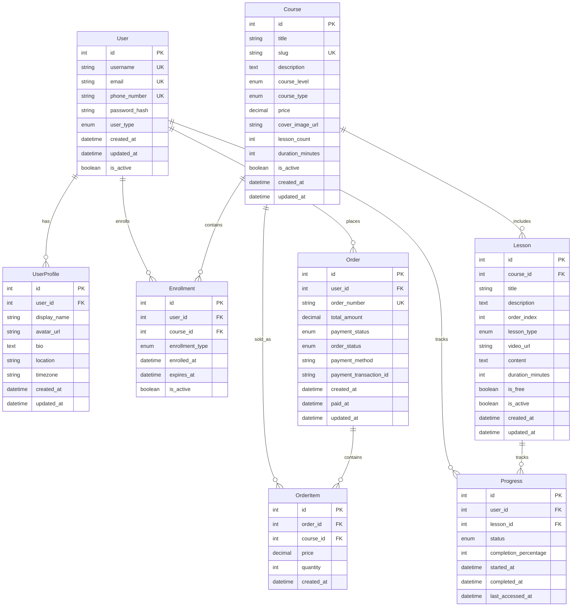

# UAI教育平台 - MVP核心数据模型

> **文档目标**: 定义MVP阶段的核心数据结构，为开发团队提供数据建模基础
> 
> **更新时间**: 2025-08-31  
> **负责人**: 后端架构师 + 产品经理

## 🎯 MVP数据模型策略

**核心原则**: 简化数据结构，聚焦核心业务流程，确保可扩展性

**技术选型**: Django + MySQL 8.4+（生产环境）/ SQLite（开发环境）

---

## 📊 MVP核心数据实体关系图



---

## 📋 MVP核心数据表详细定义

### 1. User - 用户基础表

```sql
CREATE TABLE users (
    id BIGINT PRIMARY KEY AUTO_INCREMENT,
    username VARCHAR(50) UNIQUE NOT NULL,
    email VARCHAR(255) UNIQUE NOT NULL,
    phone_number VARCHAR(20) UNIQUE,
    password_hash VARCHAR(255) NOT NULL,
    user_type ENUM('guest', 'registered', 'premium') DEFAULT 'registered',
    is_active BOOLEAN DEFAULT TRUE,
    created_at TIMESTAMP DEFAULT CURRENT_TIMESTAMP,
    updated_at TIMESTAMP DEFAULT CURRENT_TIMESTAMP ON UPDATE CURRENT_TIMESTAMP,
    
    INDEX idx_email (email),
    INDEX idx_phone (phone_number),
    INDEX idx_user_type (user_type),
    INDEX idx_created_at (created_at)
);
```

**MVP简化说明**:
- 暂时只支持3种用户类型（简化RBAC）
- 手机号支持但不强制（海外用户考虑）

### 2. UserProfile - 用户档案表

```sql
CREATE TABLE user_profiles (
    id BIGINT PRIMARY KEY AUTO_INCREMENT,
    user_id BIGINT NOT NULL,
    display_name VARCHAR(100),
    avatar_url VARCHAR(500),
    bio TEXT,
    location VARCHAR(100),
    timezone VARCHAR(50) DEFAULT 'Asia/Shanghai',
    created_at TIMESTAMP DEFAULT CURRENT_TIMESTAMP,
    updated_at TIMESTAMP DEFAULT CURRENT_TIMESTAMP ON UPDATE CURRENT_TIMESTAMP,
    
    FOREIGN KEY (user_id) REFERENCES users(id) ON DELETE CASCADE,
    INDEX idx_user_id (user_id)
);
```

**MVP简化说明**:
- 基础档案信息，支持个性化展示
- timezone字段支持海外用户

### 3. Course - 课程主表

```sql
CREATE TABLE courses (
    id BIGINT PRIMARY KEY AUTO_INCREMENT,
    title VARCHAR(200) NOT NULL,
    slug VARCHAR(100) UNIQUE NOT NULL,
    description TEXT,
    course_level ENUM('beginner', 'intermediate', 'advanced') DEFAULT 'beginner',
    course_type ENUM('free', 'paid', 'premium') DEFAULT 'paid',
    price DECIMAL(10,2) DEFAULT 0.00,
    cover_image_url VARCHAR(500),
    lesson_count INT DEFAULT 0,
    duration_minutes INT DEFAULT 0,
    is_active BOOLEAN DEFAULT TRUE,
    created_at TIMESTAMP DEFAULT CURRENT_TIMESTAMP,
    updated_at TIMESTAMP DEFAULT CURRENT_TIMESTAMP ON UPDATE CURRENT_TIMESTAMP,
    
    INDEX idx_slug (slug),
    INDEX idx_course_level (course_level),
    INDEX idx_course_type (course_type),
    INDEX idx_is_active (is_active)
);
```

**MVP简化说明**:
- 只支持3个级别（对应3层课程体系）
- 3种课程类型满足MVP需求

### 4. Lesson - 课程内容表

```sql
CREATE TABLE lessons (
    id BIGINT PRIMARY KEY AUTO_INCREMENT,
    course_id BIGINT NOT NULL,
    title VARCHAR(200) NOT NULL,
    description TEXT,
    order_index INT NOT NULL,
    lesson_type ENUM('video', 'text', 'quiz', 'project') DEFAULT 'video',
    video_url VARCHAR(500),
    content LONGTEXT,
    duration_minutes INT DEFAULT 0,
    is_free BOOLEAN DEFAULT FALSE,
    is_active BOOLEAN DEFAULT TRUE,
    created_at TIMESTAMP DEFAULT CURRENT_TIMESTAMP,
    updated_at TIMESTAMP DEFAULT CURRENT_TIMESTAMP ON UPDATE CURRENT_TIMESTAMP,
    
    FOREIGN KEY (course_id) REFERENCES courses(id) ON DELETE CASCADE,
    INDEX idx_course_id (course_id),
    INDEX idx_order_index (order_index),
    INDEX idx_is_free (is_free)
);
```

### 5. Enrollment - 用户注册课程表

```sql
CREATE TABLE enrollments (
    id BIGINT PRIMARY KEY AUTO_INCREMENT,
    user_id BIGINT NOT NULL,
    course_id BIGINT NOT NULL,
    enrollment_type ENUM('free', 'paid', 'premium') DEFAULT 'paid',
    enrolled_at TIMESTAMP DEFAULT CURRENT_TIMESTAMP,
    expires_at TIMESTAMP NULL,
    is_active BOOLEAN DEFAULT TRUE,
    
    FOREIGN KEY (user_id) REFERENCES users(id) ON DELETE CASCADE,
    FOREIGN KEY (course_id) REFERENCES courses(id) ON DELETE CASCADE,
    UNIQUE KEY uk_user_course (user_id, course_id),
    INDEX idx_user_id (user_id),
    INDEX idx_course_id (course_id),
    INDEX idx_enrollment_type (enrollment_type)
);
```

### 6. Progress - 学习进度表

```sql
CREATE TABLE progress (
    id BIGINT PRIMARY KEY AUTO_INCREMENT,
    user_id BIGINT NOT NULL,
    lesson_id BIGINT NOT NULL,
    status ENUM('not_started', 'in_progress', 'completed') DEFAULT 'not_started',
    completion_percentage INT DEFAULT 0,
    started_at TIMESTAMP NULL,
    completed_at TIMESTAMP NULL,
    last_accessed_at TIMESTAMP DEFAULT CURRENT_TIMESTAMP ON UPDATE CURRENT_TIMESTAMP,
    
    FOREIGN KEY (user_id) REFERENCES users(id) ON DELETE CASCADE,
    FOREIGN KEY (lesson_id) REFERENCES lessons(id) ON DELETE CASCADE,
    UNIQUE KEY uk_user_lesson (user_id, lesson_id),
    INDEX idx_user_id (user_id),
    INDEX idx_lesson_id (lesson_id),
    INDEX idx_status (status)
);
```

### 7. Order - 订单主表

```sql
CREATE TABLE orders (
    id BIGINT PRIMARY KEY AUTO_INCREMENT,
    user_id BIGINT NOT NULL,
    order_number VARCHAR(32) UNIQUE NOT NULL,
    total_amount DECIMAL(10,2) NOT NULL DEFAULT 0.00,
    payment_status ENUM('pending', 'paid', 'failed', 'refunded') DEFAULT 'pending',
    order_status ENUM('created', 'processing', 'completed', 'cancelled') DEFAULT 'created',
    payment_method VARCHAR(50),
    payment_transaction_id VARCHAR(100),
    created_at TIMESTAMP DEFAULT CURRENT_TIMESTAMP,
    paid_at TIMESTAMP NULL,
    updated_at TIMESTAMP DEFAULT CURRENT_TIMESTAMP ON UPDATE CURRENT_TIMESTAMP,
    
    FOREIGN KEY (user_id) REFERENCES users(id) ON DELETE CASCADE,
    INDEX idx_user_id (user_id),
    INDEX idx_order_number (order_number),
    INDEX idx_payment_status (payment_status),
    INDEX idx_created_at (created_at)
);
```

### 8. OrderItem - 订单明细表

```sql
CREATE TABLE order_items (
    id BIGINT PRIMARY KEY AUTO_INCREMENT,
    order_id BIGINT NOT NULL,
    course_id BIGINT NOT NULL,
    price DECIMAL(10,2) NOT NULL,
    quantity INT DEFAULT 1,
    created_at TIMESTAMP DEFAULT CURRENT_TIMESTAMP,
    
    FOREIGN KEY (order_id) REFERENCES orders(id) ON DELETE CASCADE,
    FOREIGN KEY (course_id) REFERENCES courses(id) ON DELETE RESTRICT,
    INDEX idx_order_id (order_id),
    INDEX idx_course_id (course_id)
);
```

---

## 🚀 MVP数据流程设计

### 用户注册流程
```
1. User表创建基础账户
2. UserProfile表创建用户档案
3. 自动注册免费体验课程（Enrollment表）
4. 初始化学习进度（Progress表）
```

### 课程购买流程
```
1. 创建订单（Order表）
2. 添加课程明细（OrderItem表）
3. 支付成功后更新支付状态
4. 自动创建课程注册记录（Enrollment表）
5. 初始化课程学习进度（Progress表）
```

### 学习进度跟踪
```
1. 用户开始学习课程时更新Progress.started_at
2. 实时更新Progress.completion_percentage
3. 完成时更新Progress.completed_at和status
4. 统计课程整体完成进度
```

---

## 📊 MVP性能考量

### 索引策略
- **高频查询字段**: email, phone_number, course_id, user_id
- **范围查询字段**: created_at, enrolled_at, paid_at
- **状态查询字段**: user_type, payment_status, order_status

### 数据量预估（MVP阶段）
- **用户表**: 1万用户（6个月目标）
- **课程表**: 50门课程
- **课程内容**: 1000个lesson
- **学习记录**: 50万条progress记录
- **订单数据**: 5000个订单

### 查询优化
- 使用复合索引优化多条件查询
- Progress表按user_id分区（后期考虑）
- 读写分离（扩展阶段考虑）

---

## 🔒 MVP安全考量

### 数据保护
- 密码使用bcrypt哈希存储
- 敏感字段（手机号、邮箱）考虑脱敏展示
- 支付相关信息遵循PCI DSS基础要求

### 数据完整性
- 外键约束确保数据一致性
- 关键业务逻辑添加唯一约束
- 软删除重要数据，硬删除敏感数据

---

## 🚀 扩展性设计

### 预留扩展字段
- 各表预留metadata字段存储JSON扩展信息
- 用户表预留第三方登录字段
- 课程表预留分类、标签字段

### 后续优化方向
1. **分库分表**: 用户量达到10万时考虑
2. **缓存策略**: Redis缓存热点数据
3. **搜索引擎**: 集成Elasticsearch支持课程搜索
4. **数据仓库**: 分析用户行为和业务指标

---

## 📝 Django模型映射示例

```python
# models.py 核心模型示例
class User(AbstractUser):
    user_type = models.CharField(max_length=20, choices=USER_TYPE_CHOICES, default='registered')
    phone_number = models.CharField(max_length=20, unique=True, null=True, blank=True)
    
class Course(models.Model):
    title = models.CharField(max_length=200)
    slug = models.SlugField(max_length=100, unique=True)
    course_level = models.CharField(max_length=20, choices=LEVEL_CHOICES)
    price = models.DecimalField(max_digits=10, decimal_places=2, default=0)
    
class Progress(models.Model):
    user = models.ForeignKey(User, on_delete=models.CASCADE)
    lesson = models.ForeignKey(Lesson, on_delete=models.CASCADE)
    completion_percentage = models.IntegerField(default=0)
    
    class Meta:
        unique_together = ['user', 'lesson']
```

---

*此文档随开发进展实时更新，确保数据模型与业务需求同步*