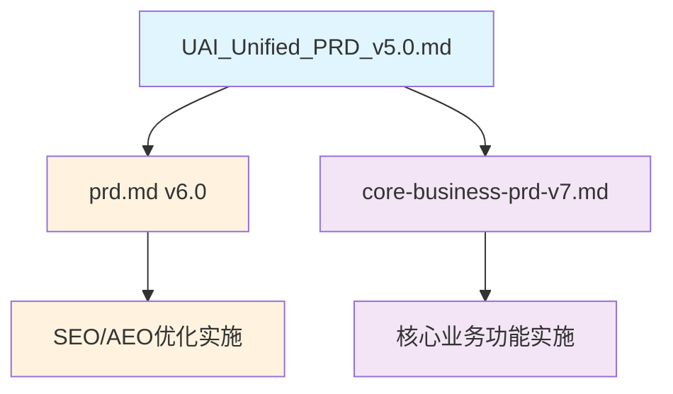

# UAI教育平台 - PRD管理文档

> 本文档统一管理UAI教育平台的所有产品需求文档，包括版本关系、依赖关系和实施优先级。

## 📋 PRD文档架构

### 当前PRD体系



## 📄 PRD文档清单

| PRD文档 | 版本 | 状态 | 专注领域 | 文件路径 | 更新日期 |
|---------|------|------|----------|----------|----------|
| **UAI统一PRD** | v5.0 | 📋 基础框架 | 整体产品愿景和技术决策 | `/docs/UAI_Unified_PRD_v5.0.md` | 历史版本 |
| **SEO/AEO优化PRD** | v6.0 | ✅ 完成 | 搜索引擎优化和流量获取 | `/docs/prd.md` | 2025-08-31 |
| **核心业务功能PRD** | v7.0 | ✅ 完成 | 教育产品核心功能和用户体验 | `/docs/core-business-prd-v7.md` | 2025-08-31 |

## 🎯 PRD领域划分

### PRD v5.0 - 基础框架（历史文档）
**领域范围**: 整体产品愿景、技术栈选择、基础架构
- 产品定位和市场分析
- 技术栈决策（Vue 3 + Django）
- 基础业务规则定义
- 初期功能规划

### PRD v6.0 - SEO/AEO优化专项
**领域范围**: 搜索引擎优化、流量获取、内容分发
- **Epic 1**: SEO基础设施升级与监控体系建立
- **Epic 2**: 多平台AEO内容管理与分发系统  
- **Epic 3**: 外链权威性与EEAT信号管理系统
- **Epic 4**: SEO/AEO效果分析与A/B测试平台

### PRD v7.0 - 核心业务功能专项  
**领域范围**: 教育产品功能、用户体验、商业模式
- **Epic 1**: 用户认证和基础框架
- **Epic 2**: 分层课程体系架构
- **Epic 3**: 付费转化和会员系统
- **Epic 4**: 学习体验和内容管理

## 🔗 PRD依赖关系

### 技术依赖
```
PRD v5.0 (技术栈) 
    ↓ 继承技术决策
PRD v6.0 (SEO优化) + PRD v7.0 (核心业务)
    ↓ 共享技术基础
最终产品实现
```

### 功能依赖
- **无冲突**: v6.0和v7.0功能完全独立，可并行开发
- **数据共享**: 两个PRD共享用户数据、课程数据等基础实体
- **界面集成**: SEO优化的管理界面需要集成到v7.0的管理后台中

### 优先级依赖
- **推荐顺序**: v7.0核心功能 → v6.0 SEO优化
- **原因**: 先有产品内容，再做流量获取优化
- **并行可能**: 两个PRD可以由不同团队同时开发

## 🚀 实施计划

### Phase 1: 核心业务功能 (PRD v7.0)
**目标**: 建立完整的AI+Logo设计教育平台
**时间**: 优先实施
**团队**: 前端 + 后端 + 产品

**关键里程碑**:
1. ✅ 用户认证系统（多登录方式）
2. ✅ 分层课程体系（7层架构）
3. ✅ 付费和会员系统
4. ✅ 学习体验优化

### Phase 2: SEO/AEO优化 (PRD v6.0)
**目标**: 最大化自然流量获取
**时间**: 核心功能稳定后
**团队**: SEO专家 + 技术 + 内容运营

**关键里程碑**:
1. ✅ SEO技术基础设施
2. ✅ 多平台内容分发
3. ✅ 外链和权威性建设  
4. ✅ 效果监控和优化

## 📊 成功指标整合

### 业务指标 (来自v7.0)
- 注册转化率 > 15%
- 付费转化率 > 8%
- 会员转化率 > 25%
- 30天留存率 > 40%

### 流量指标 (来自v6.0)  
- 有机流量增长 > 30%
- 搜索关键词排名提升
- 多平台曝光增长
- SEO转化率优化

## ⚠️ 风险和注意事项

### PRD冲突风险
- **数据模型冲突**: 确保两个PRD的数据设计兼容
- **界面集成冲突**: SEO管理功能需要统一的UI风格
- **性能影响**: SEO优化不能影响核心业务功能的性能

### 缓解措施
- 定期进行PRD交叉评审
- 建立统一的数据字典和API规范
- 前端组件库统一管理

## 📝 维护说明

### 更新流程
1. **单个PRD更新**: 直接修改对应PRD文档
2. **跨PRD影响**: 更新本管理文档的依赖关系
3. **版本发布**: 更新上表中的版本号和状态

### 文档责任人
- **PRD v6.0 (SEO优化)**: SEO专家 + 产品经理
- **PRD v7.0 (核心业务)**: 产品经理 + 技术负责人
- **PRD管理文档**: 产品经理维护

---

**文档更新**: 2025-08-31  
**维护人**: 产品团队  
**下次评审**: 每月第一周