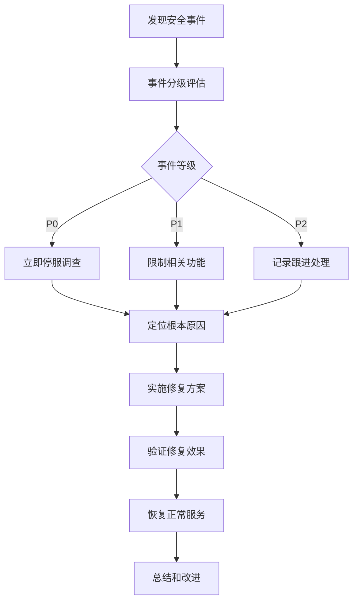

# UAI教育平台 - MVP安全基线

> **文档目标**: 定义MVP阶段的安全基础要求，确保产品安全上线
> 
> **更新时间**: 2025-08-31  
> **负责人**: 安全架构师 + 后端负责人

## 🎯 MVP安全策略

**核心原则**: 安全基础优先，逐步完善

- **最小权限原则**: 用户只能访问必要的资源
- **纵深防御**: 多层安全控制机制
- **快速响应**: 及时发现和修复安全问题
- **合规基础**: 满足基本的数据保护要求

---

## 🔐 1. 身份认证和授权

### 用户认证机制

**主要认证方式**:
- 邮箱 + 密码认证（主要）
- 手机号 + 验证码认证（辅助）
- 第三方OAuth登录（微信，后期支持）

**密码安全策略**:
```python
# 密码复杂度要求
PASSWORD_MIN_LENGTH = 8
PASSWORD_REQUIREMENTS = {
    'require_uppercase': True,     # 至少1个大写字母
    'require_lowercase': True,     # 至少1个小写字母  
    'require_numbers': True,       # 至少1个数字
    'require_symbols': False,      # 符号可选（降低用户门槛）
    'max_similarity': 0.7,         # 与个人信息相似度限制
}

# 密码存储
HASH_ALGORITHM = 'bcrypt'          # 使用bcrypt加密
HASH_ROUNDS = 12                   # 加密轮数
```

**JWT Token配置**:
```python
JWT_SETTINGS = {
    'ACCESS_TOKEN_LIFETIME': timedelta(hours=4),      # 访问token 4小时
    'REFRESH_TOKEN_LIFETIME': timedelta(days=7),       # 刷新token 7天
    'ROTATE_REFRESH_TOKENS': True,                     # 刷新时轮换token
    'BLACKLIST_AFTER_ROTATION': True,                  # 轮换后列入黑名单
    'UPDATE_LAST_LOGIN': True,                         # 更新最后登录时间
}
```

### 权限控制策略

**MVP三角色架构**:
- **管理员（Admin）**: 完整的系统管理权限
- **会员（Member）**: 付费内容访问权限
- **访客（Guest）**: 基础浏览和免费内容权限

**权限检查实现**:
```python
# Django权限装饰器
from functools import wraps
from django.core.exceptions import PermissionDenied

def require_role(required_role):
    def decorator(view_func):
        @wraps(view_func)
        def _wrapped_view(request, *args, **kwargs):
            if not hasattr(request, 'user') or not request.user.is_authenticated:
                raise PermissionDenied("需要登录")
            
            if request.user.user_type not in get_allowed_roles(required_role):
                raise PermissionDenied("权限不足")
                
            return view_func(request, *args, **kwargs)
        return _wrapped_view
    return decorator
```

---

## 🛡️ 2. 数据安全保护

### 敏感数据保护

**数据分类标准**:
- **高敏感**: 密码、支付信息、身份证号
- **中敏感**: 邮箱、手机号、学习记录
- **低敏感**: 用户名、课程进度、公开信息

**数据加密策略**:
```python
# 敏感字段加密存储
from cryptography.fernet import Fernet

class EncryptedField(models.TextField):
    def __init__(self, *args, **kwargs):
        self.cipher_suite = Fernet(settings.FIELD_ENCRYPTION_KEY)
        super().__init__(*args, **kwargs)
    
    def get_prep_value(self, value):
        if value is None:
            return value
        return self.cipher_suite.encrypt(value.encode()).decode()
    
    def from_db_value(self, value, expression, connection):
        if value is None:
            return value
        return self.cipher_suite.decrypt(value.encode()).decode()
```

**数据脱敏策略**:
```python
# API响应数据脱敏
def mask_sensitive_data(data, field_name):
    if field_name == 'email':
        # user@example.com -> u***@example.com
        return mask_email(data)
    elif field_name == 'phone_number':
        # 13800138000 -> 138****8000
        return mask_phone(data)
    return data
```

### 数据传输安全

**HTTPS配置**:
- 全站强制HTTPS（HSTS）
- TLS 1.3优先，最低支持TLS 1.2
- 强制安全Cookie（Secure, HttpOnly, SameSite）

```python
# Django HTTPS安全配置
SECURE_SSL_REDIRECT = True                    # 强制HTTPS重定向
SECURE_HSTS_SECONDS = 31536000               # HSTS 1年
SECURE_HSTS_INCLUDE_SUBDOMAINS = True        # 包含子域名
SECURE_HSTS_PRELOAD = True                   # 支持HSTS预加载

SESSION_COOKIE_SECURE = True                 # Session Cookie安全
CSRF_COOKIE_SECURE = True                    # CSRF Cookie安全
SESSION_COOKIE_HTTPONLY = True               # 防止XSS获取Cookie
CSRF_COOKIE_SAMESITE = 'Strict'             # 防CSRF攻击
```

---

## 🚨 3. 应用安全防护

### 输入验证和防注入

**SQL注入防护**:
```python
# 使用Django ORM参数化查询（自动防注入）
# ✅ 安全的查询方式
User.objects.filter(email=user_email)

# ❌ 避免原生SQL拼接
# cursor.execute(f"SELECT * FROM users WHERE email = '{user_email}'")
```

**XSS防护**:
```python
# 前端输出转义
from django.utils.html import escape

def safe_output(content):
    """安全输出用户内容，防XSS"""
    return escape(content)

# Vue.js模板自动转义
# {{ userInput }}  -> 自动转义
# v-html="userInput" -> 需要手动验证和转义
```

**CSRF防护**:
```python
# Django内置CSRF保护
MIDDLEWARE = [
    'django.middleware.csrf.CsrfViewMiddleware',  # CSRF中间件
]

# API接口CSRF豁免（使用JWT认证）
from django.views.decorators.csrf import csrf_exempt
from django.utils.decorators import method_decorator

@method_decorator(csrf_exempt, name='dispatch')
class APIView(View):
    pass
```

### 接口安全控制

**API速率限制**:
```python
# Django REST Framework速率限制
REST_FRAMEWORK = {
    'DEFAULT_THROTTLE_CLASSES': [
        'rest_framework.throttling.AnonRateThrottle',
        'rest_framework.throttling.UserRateThrottle'
    ],
    'DEFAULT_THROTTLE_RATES': {
        'anon': '100/hour',        # 匿名用户每小时100次
        'user': '1000/hour',       # 认证用户每小时1000次
        'login': '5/min',          # 登录接口每分钟5次
        'register': '3/min',       # 注册接口每分钟3次
    }
}
```

**请求验证和过滤**:
```python
# 请求大小限制
DATA_UPLOAD_MAX_MEMORY_SIZE = 2621440  # 2.5MB
FILE_UPLOAD_MAX_MEMORY_SIZE = 2621440  # 2.5MB

# IP白名单（管理接口）
ADMIN_IP_WHITELIST = [
    '127.0.0.1',
    '10.0.0.0/8',     # 内网IP段
]

# 请求头验证
ALLOWED_HOSTS = [
    'api.uaiedu.com',
    'uaiedu.com',
    'localhost',
    '127.0.0.1',
]
```

---

## 🔍 4. 安全监控和日志

### 安全日志记录

**日志分类和级别**:
```python
LOGGING = {
    'version': 1,
    'disable_existing_loggers': False,
    'formatters': {
        'security': {
            'format': '[{levelname}] {asctime} {name} {message}',
            'style': '{',
        },
    },
    'handlers': {
        'security_file': {
            'level': 'WARNING',
            'class': 'logging.FileHandler',
            'filename': 'logs/security.log',
            'formatter': 'security',
        },
    },
    'loggers': {
        'security': {
            'handlers': ['security_file'],
            'level': 'WARNING',
            'propagate': False,
        },
    },
}
```

**关键安全事件记录**:
- 登录失败次数超限
- 权限访问异常
- 支付异常操作
- 敏感数据访问
- API调用异常

### 异常行为监控

**自动监控规则**:
```python
# 登录异常检测
LOGIN_ATTEMPT_LIMIT = 5           # 5次失败锁定账户
LOCKOUT_DURATION = 3600           # 锁定1小时

# API调用异常检测  
API_CALL_SPIKE_THRESHOLD = 200    # 单用户单分钟200次为异常
SUSPICIOUS_IP_THRESHOLD = 50      # 单IP单分钟50次登录为可疑

# 支付异常检测
PAYMENT_RETRY_LIMIT = 3           # 支付失败3次暂停
HIGH_VALUE_ALERT = 1000           # 超过1000元的订单需要额外验证
```

---

## 💳 5. 支付安全规范

### 支付数据保护

**PCI DSS基础要求**:
- 不存储完整信用卡号
- 支付流程使用HTTPS
- 敏感支付数据传输加密
- 支付接口独立权限控制

**支付接口安全**:
```python
# 支付参数验证
from decimal import Decimal

def validate_payment_amount(amount):
    """验证支付金额合法性"""
    if not isinstance(amount, (int, float, Decimal)):
        raise ValueError("金额格式错误")
    
    if amount <= 0:
        raise ValueError("金额必须大于0")
        
    if amount > 10000:  # MVP阶段限制单笔最高金额
        raise ValueError("单笔金额不能超过10000元")
    
    return Decimal(str(amount))

# 支付回调验证
def verify_payment_callback(request):
    """验证支付回调的合法性"""
    signature = request.META.get('HTTP_SIGNATURE')
    if not signature:
        return False
        
    # 验证签名算法（具体实现依赖支付平台）
    return verify_signature(request.body, signature)
```

---

## 🚧 6. 安全开发规范

### 代码安全审查

**安全编码检查清单**:
- [ ] 所有用户输入进行验证和转义
- [ ] 使用参数化查询，避免SQL注入
- [ ] 敏感信息不在代码中硬编码
- [ ] 错误信息不泄露系统内部信息
- [ ] 文件上传限制类型和大小
- [ ] 会话管理遵循最佳实践

**依赖安全管理**:
```bash
# 定期检查依赖漏洞
pip-audit                    # Python依赖安全检查
npm audit                    # Node.js依赖安全检查

# 自动化安全扫描
bandit backend/             # Python代码安全扫描
eslint --ext .js,.vue frontend/  # JavaScript代码检查
```

### 环境配置安全

**环境变量管理**:
```python
# settings.py 环境变量配置
import os
from pathlib import Path

# 敏感配置使用环境变量
SECRET_KEY = os.environ.get('DJANGO_SECRET_KEY')
DATABASE_PASSWORD = os.environ.get('DB_PASSWORD')
JWT_SECRET_KEY = os.environ.get('JWT_SECRET_KEY')

# 生产环境安全配置
DEBUG = os.environ.get('DEBUG', 'False').lower() == 'true'
ALLOWED_HOSTS = os.environ.get('ALLOWED_HOSTS', '').split(',')
```

**部署安全配置**:
```yaml
# Railway环境变量（不包含敏感值）
DJANGO_SETTINGS_MODULE=uai_backend.settings.production
DEBUG=False
ALLOWED_HOSTS=api.uaiedu.com,uaiedu.com

# 敏感环境变量在Railway Dashboard中配置
# SECRET_KEY=xxxxx
# DB_PASSWORD=xxxxx  
# JWT_SECRET_KEY=xxxxx
```

---

## ⚠️ 7. 应急响应计划

### 安全事件分类

**P0级事件（立即处理）**:
- 数据泄露事件
- 支付系统异常
- 系统被入侵攻击
- 大量用户无法访问

**P1级事件（1小时内处理）**:
- 单用户账户异常
- API异常调用
- 权限控制失效
- 敏感日志异常

**P2级事件（24小时内处理）**:
- 安全配置优化
- 依赖漏洞修复
- 监控告警调整

### 应急处理流程



### 联系方式和职责

**安全事件响应团队**:
- **技术负责人**: 技术决策和资源协调
- **开发工程师**: 代码修复和部署
- **运维工程师**: 系统恢复和监控
- **产品经理**: 用户沟通和业务影响评估

---

## 📋 8. MVP安全检查清单

### 上线前安全验证

**基础安全配置**:
- [ ] HTTPS全站配置完成
- [ ] 数据库访问权限配置正确
- [ ] 敏感信息使用环境变量
- [ ] 调试模式在生产环境关闭

**认证授权功能**:
- [ ] 密码复杂度验证生效
- [ ] JWT token正常签发和验证
- [ ] 权限控制逻辑正确
- [ ] 登录失败次数限制生效

**API安全防护**:
- [ ] 速率限制配置生效
- [ ] 输入验证和转义正常
- [ ] CSRF保护启用
- [ ] 错误信息不泄露敏感数据

**数据保护措施**:
- [ ] 敏感数据加密存储
- [ ] 数据传输HTTPS加密
- [ ] 支付相关数据安全处理
- [ ] 用户隐私信息脱敏展示

### 持续安全维护

**定期安全任务**:
- 每周：检查安全日志和异常
- 每月：更新依赖库和安全补丁
- 每季度：进行安全配置审查
- 每半年：开展渗透测试

---

## 🔄 安全改进计划

### MVP后续安全增强

**短期计划（1-3个月）**:
- 完善API安全监控
- 增加更多第三方登录
- 实现设备指纹识别
- 加强支付安全验证

**中期计划（3-6个月）**:
- 实施Web应用防火墙(WAF)
- 建立安全运营中心(SOC)
- 完善数据备份和恢复
- 开展安全意识培训

**长期计划（6个月+）**:
- ISO 27001安全管理体系
- 数据分类分级管理
- 零信任网络架构
- 自动化安全测试

---

*此安全基线将随系统演进持续更新，确保安全防护与业务发展同步*