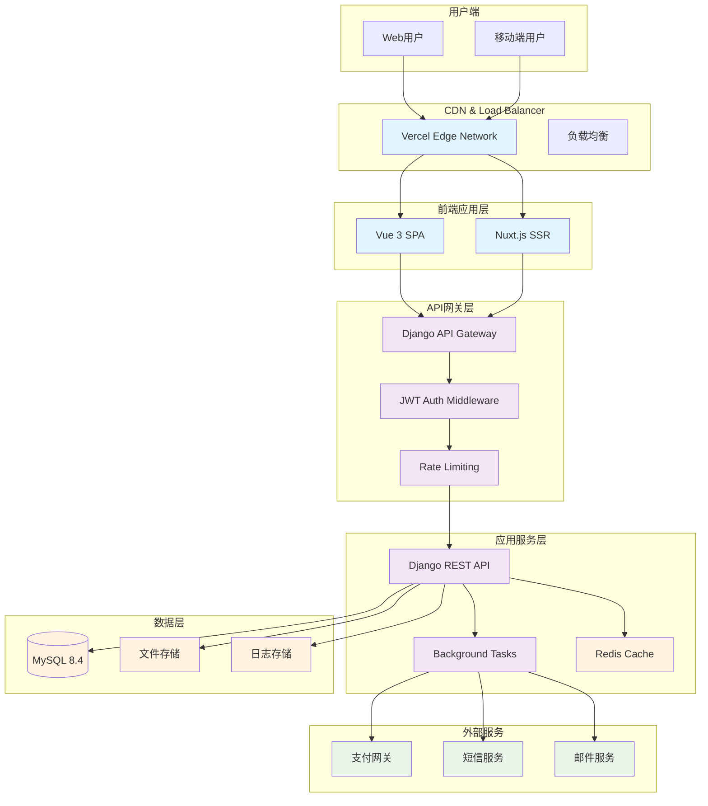
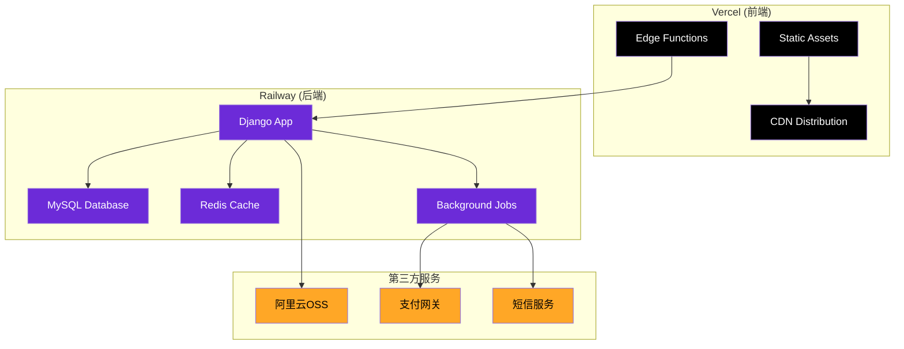

# UAI教育平台 - MVP系统架构

> **文档目标**: 定义MVP阶段的系统架构设计，指导技术实现和部署
> 
> **更新时间**: 2025-08-31  
> **负责人**: 技术架构师 + DevOps工程师

## 🎯 MVP架构设计原则

**核心理念**: 简单可用 > 完美架构

- **单体优先**: MVP阶段避免过度设计，采用单体架构
- **前后端分离**: 清晰的职责边界，便于团队并行开发
- **云原生部署**: 利用PaaS平台快速部署和扩展
- **增量架构**: 设计时考虑后续微服务化路径

---

## 🏗️ 系统架构总览



---

## 📱 前端架构设计

### 技术栈选择
- **框架**: Vue 3 + Composition API + TypeScript
- **构建工具**: Vite 4.x
- **UI框架**: Bootstrap 5.3.6（轻量化定制）
- **状态管理**: Pinia
- **路由管理**: Vue Router 4
- **HTTP客户端**: Axios
- **部署平台**: Vercel

### 应用架构
```
src/
├── views/           # 页面组件（路由级别）
│   ├── Auth/        # 认证相关页面
│   ├── Course/      # 课程相关页面
│   └── User/        # 用户中心页面
├── components/      # 可复用组件
│   ├── common/      # 通用组件
│   ├── course/      # 课程相关组件
│   └── user/        # 用户相关组件
├── store/           # Pinia状态管理
│   ├── auth.ts      # 认证状态
│   ├── course.ts    # 课程状态
│   └── user.ts      # 用户状态
├── api/             # API接口封装
│   ├── auth.ts
│   ├── course.ts
│   └── user.ts
├── router/          # 路由配置
├── utils/           # 工具函数
└── types/           # TypeScript类型定义
```

### MVP前端功能模块
- **认证模块**: 注册、登录、密码重置
- **课程模块**: 课程列表、详情、学习页面
- **用户模块**: 个人中心、学习进度、订单管理
- **支付模块**: 购买流程、支付状态

---

## 🖥️ 后端架构设计

### 技术栈选择
- **框架**: Django 5.2 + Django REST Framework
- **数据库**: MySQL 8.4（生产）/ SQLite（开发）
- **缓存**: Redis 7.x
- **任务队列**: Celery + Redis
- **认证**: JWT (SimpleJWT)
- **部署平台**: Railway

### 应用架构
```
backend/
├── uai_backend/         # Django项目配置
│   ├── settings/        # 环境配置
│   │   ├── base.py      # 基础配置
│   │   ├── development.py # 开发环境
│   │   └── production.py  # 生产环境
│   ├── urls.py          # 路由配置
│   └── wsgi.py          # WSGI应用
├── apps/                # 应用模块
│   ├── authentication/ # 用户认证
│   ├── courses/         # 课程管理
│   ├── learning/        # 学习进度
│   ├── orders/          # 订单支付
│   └── common/          # 公共模块
├── requirements/        # 依赖管理
│   ├── base.txt         # 基础依赖
│   ├── development.txt  # 开发依赖
│   └── production.txt   # 生产依赖
└── static/              # 静态文件
```

### Django应用模块设计

#### 1. Authentication App
- 用户模型扩展
- JWT认证中间件
- 权限装饰器
- 用户档案管理

#### 2. Courses App
- 课程模型定义
- 课程CRUD API
- 课程注册逻辑
- 课程搜索功能（后期）

#### 3. Learning App
- 学习进度跟踪
- 课程完成统计
- 学习数据分析
- 学习提醒功能

#### 4. Orders App
- 订单管理系统
- 支付集成接口
- 订单状态流转
- 退款处理逻辑

---

## 🗄️ 数据架构设计

### 数据库选型
**开发环境**: SQLite
- 零配置，快速启动
- 适合单人开发调试

**生产环境**: MySQL 8.4
- 成熟稳定的关系型数据库
- 优秀的JSON支持
- 强大的索引优化能力
- Railway平台原生支持

### 缓存策略
**Redis用途**:
- Session存储
- API响应缓存
- 任务队列支持
- 实时数据缓存

**缓存层级**:
```
浏览器缓存 (1小时) 
    ↓
CDN缓存 (24小时)
    ↓
Redis缓存 (10分钟)
    ↓
MySQL数据库
```

### 文件存储
- **开发环境**: 本地文件系统
- **生产环境**: 云存储（阿里云OSS/AWS S3）
- **文件类型**: 
  - 用户头像
  - 课程封面
  - 视频资源
  - 学习材料

---

## 🚀 部署架构设计

### 生产环境部署



### 环境配置
- **开发环境**: 本地开发 + 热重载
- **测试环境**: Railway Staging + Vercel Preview
- **生产环境**: Railway Production + Vercel Production

### CI/CD流程
```
Git Push → GitHub Actions → 自动测试 → 部署到测试环境 → 手动部署到生产环境
```

---

## 📊 性能设计目标

### MVP性能指标
- **首页加载时间**: < 2秒
- **API响应时间**: < 500ms (P95)
- **系统可用性**: > 99%
- **并发用户**: 支持100+在线用户

### 优化策略
1. **前端优化**:
   - 代码分割和懒加载
   - 图片压缩和WebP格式
   - HTTP/2和资源预加载

2. **后端优化**:
   - 数据库索引优化
   - Redis缓存热点数据
   - 异步任务处理

3. **CDN优化**:
   - 静态资源全球分发
   - 智能路由加速

---

## 🔒 安全架构设计

### 认证授权
- **JWT Token**: 无状态认证
- **Refresh Token**: 安全的token刷新机制
- **权限控制**: 基于角色的访问控制

### 数据安全
- **传输加密**: HTTPS全站加密
- **数据加密**: 敏感数据字段加密存储
- **SQL防注入**: 使用ORM参数化查询

### API安全
- **请求限制**: 基于IP和用户的速率限制
- **CSRF保护**: Django内置CSRF防护
- **CORS配置**: 严格的跨域资源控制

---

## 📈 扩展性设计

### 短期扩展（3-6个月）
- **水平扩展**: Railway多实例部署
- **读写分离**: MySQL主从配置
- **CDN优化**: 更多地区节点

### 中期扩展（6-12个月）
- **微服务拆分**: 按业务域拆分服务
- **消息队列**: 服务间异步通信
- **搜索引擎**: Elasticsearch集成

### 长期扩展（1年+）
- **多云部署**: 避免单一平台依赖
- **容器化**: Docker + Kubernetes
- **数据湖**: 大数据分析和AI训练

---

## 🔧 开发工具链

### 本地开发环境
```bash
# 前端开发
npm install          # 安装依赖
npm run dev          # 启动开发服务器

# 后端开发  
python -m venv venv  # 创建虚拟环境
pip install -r requirements/development.txt
python manage.py runserver

# 数据库
python manage.py migrate      # 数据库迁移
python manage.py createsuperuser  # 创建管理员
```

### 开发规范
- **代码格式**: Prettier（前端）+ Black（后端）
- **代码检查**: ESLint（前端）+ Flake8（后端）
- **类型检查**: TypeScript（前端）+ mypy（后端）
- **测试覆盖**: Jest（前端）+ pytest（后端）

---

## 📝 技术债务管理

### 当前简化决策
1. **单体架构**: MVP阶段避免微服务复杂度
2. **简化权限**: 3角色替代完整RBAC
3. **基础监控**: 简化版observability
4. **单支付渠道**: 优先支持主流支付方式

### 技术债务清单
- [ ] 微服务架构重构
- [ ] 完整的权限系统
- [ ] 全量监控和告警
- [ ] 多支付渠道集成
- [ ] 国际化多语言支持
- [ ] 移动端App开发

### 还债计划
- **Phase 2**: 完善监控和权限系统
- **Phase 3**: 微服务拆分和多支付
- **Phase 4**: 国际化和移动端

---

*此架构文档将随开发进展持续演进，确保技术决策与业务需求保持一致*